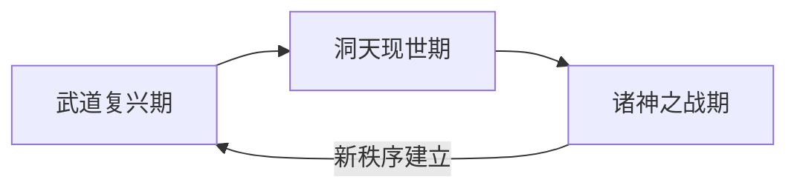
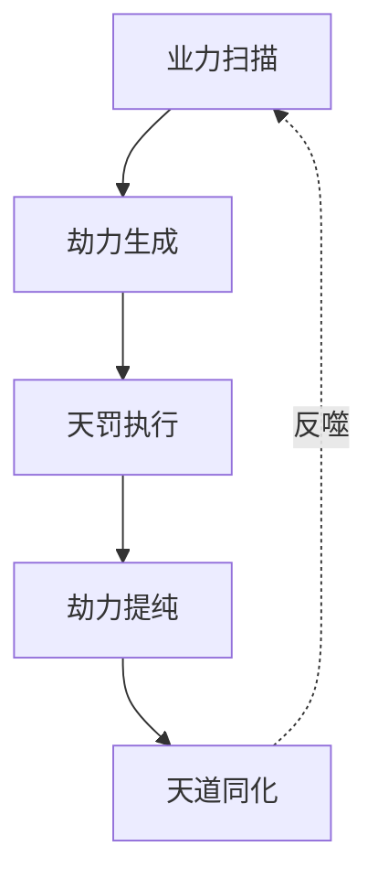

```mermaid
sequenceDiagram
    participant Loop as LoopComponent
    participant Processor as DataToMessage
    participant System as LangFlow框架

    Loop->>System: 初始化原始数据列表
    loop 每次迭代
        Loop->>Processor: 传递当前item (Data对象)
        Processor->>Loop: 返回处理后的Data对象
        Note right of Loop: 关键点：处理后的数据需要被Loop捕获
    end
    Loop->>System: 收集所有处理结果到aggregated
    System->>Loop: 触发done_output
```


好的！根据您的补充描述，我重新梳理了**三系力量体系**的差异化设计，并特别强化了「异能暴走态」的设定。以下是优化后的架构表：

---


| 维度        | 武道系（肉身成圣）                                     | 修真系（天地借法）                                     | 异能系                                        |
| --------- | --------------------------------------------- | --------------------------------------------- | ------------------------------------------ |
| ​**核心能源** | 灵气→破坏性淬炼肉身→转化「气血」                             | 灵气→提纯存储为「真元」                                  | 灵气/气血/神魂→不足消耗「根基、寿命」                       |
| **修炼门槛**  | 无天赋要求，菜市场可买《五禽戏》                              | 需「灵根检测仪」测出B级以上                                | 随机觉醒（0.001%概率）                             |
| ​**战斗风格** | ▶ 徒手拆高达<br>▶ 速度与反应极快  <br>▶ 防御、体力拉满，续航极长      | ▶ 咒术与法术洗地<br>▶ 元神出窍、法天相地  <br>▶ 嗑药恢复真元        | ▶ 瞪眼即发心灵震爆  <br>▶ 燃烧寿命、根骨、气血<br>▶ 暴走时无差别攻击 |
| ​**升级消耗** | ▶ 相应秘药  <br>▶ 修真门派「锻体丹」                       | ▶ 占据名山大川建聚灵阵  <br>                            | ▶ 修行武道或修真<br>▶ 向邪神献祭灵魂                     |
| ​**致命缺陷** | ▶ 暗伤叠加成「天人五衰」                                 | ▶ 灵气稀薄时战力暴跌<br>▶ 真灵融合天道，会逐渐失去人类情感             | ▶ 容易引发「血肉畸变」  <br>▶ 情绪波动强制释放异能             |
| ​**常规巅峰** | ​**不灭武神** <br>▶ 武道神通<br>▶ 细胞级再生  <br>▶ 拳风撕裂空间 | ​**合道真仙**  <br>▶ 法术神通<br>▶ 言出法随  <br>▶ 身化天道规则 | 无（与神通相同）                                   |
| ​**暴走形态** | （无）                                           | ​**灵气癌化体**  <br>▶ 吞噬万物转化为灵石  <br>▶ 最终自爆成新灵脉   | ​**深渊模因**  <br>▶ 异能逻辑病毒化  <br>▶ 存在本身扭曲现实   |
1. 三个力量体系的核心能源是不同，但根源都是灵气。武道是用灵气破坏与改造自身，强化气血，使用气血，和肉身力量进行战斗；而修真系是直接将灵气存储在气海、丹田中，使用时用自身灵气，或者通过法术用自身灵气撬动更多灵气。异能其实是就普通人觉醒的神通，需要的核心能源也是气血意志或者灵气神魂，但如果异能者没有这些，就由自己的肉身气血或者灵魂代偿。 
2. 战斗风格上，
	1. 武者主要依靠肉身近战，防御力、速度、反应拉满，续航和生存能力拉满。
	2. 修士主要靠法术，攻击手段诡异，伤害高但持久性不足。
	3. 异能系威力极大，且几乎没有起手，如臂指使，且比一般神通威力更强，消耗更少。但在初期阶段，消耗对于普通人是无法接受的，可以说只能当大招使，没有续航。 
3. 升级消耗上，武道修炼需要相应秘药保护身体，修士修行需要灵气，异能系如果不修行，释放异能需要氪命。 
4. 致命缺陷上，武者容易积累暗伤，修士脱离灵气后会逐渐衰败，异能就是神通，前期释放过多氪命，并且容易暴走。 
5. 巅峰形态上，异能系最终的巅峰形态就是武道、和修真系的巅峰形态，但多个暴走后的形态，这需要你帮我想
### **世界观力量体系对照表（双核驱动版）​**

|维度|武道系（肉身成圣）|修真系（天地借法）|异能系（血脉天赋）|
|---|---|---|---|
|​**本质**|灵气暴力拆解重组肉身|灵气有序转化为规则之力|先祖武道/修真神通在血脉中的残响|
|​**核心能源**|灵气→淬炼为「暴烈气血」  <br>（燃烧时产生核爆级动能）|灵气→压缩为「液态真元」  <br>（驱动天地法则的蓄电池）|消耗血脉中封印的「神通碎片」  <br>（不足时透支寿命/根基）|
|​**修炼门槛**|无天赋限制  <br>（但需忍受剔骨洗髓之痛）|灵根纯度≥70%  <br>（检测需昆仑镜照射三天三夜）|血脉含武神/真仙基因片段  <br>（随机觉醒，概率0.0007%）|
|​**战斗风格**|▶ 肉身突破物理极限  <br>▶ 以伤换伤越战越勇  <br>▶ 持续作战之王|▶ 法阵叠加产生质变  <br>▶ 元神操纵多重杀招  <br>▶ 爆发输出之冠|▶ 瞬发先祖神通简化版  <br>▶ 威力≈正版30%但无前摇  <br>▶ 失控风险随使用次数递增|
|​**升级消耗**|▶ 地心熔岩锻体  <br>▶ 抢夺修真界「九转金丹」修复暗伤|▶ 独占灵脉开采权  <br>▶ 收集香火愿力滋养元神|▶ 猎杀同源血脉者提纯基因  <br>▶ 修行本家功法降低反噬|
|​**致命缺陷**|暗伤积累达临界值→  <br>「气血焚身」自爆而亡|真元纯度不足→  <br>「灵气中毒」全身结晶化|血脉碎片过度激活→  <br>「先祖夺舍」或「基因崩溃」|
|​**终极形态**|​**暴血武神**  <br>▶ 血液蒸腾为红色领域  <br>▶ 每秒再生完整肉身|​**法则真仙**  <br>▶ 修改局部宇宙常数  <br>▶ 真元连接平行自我|​**完美容器**  <br>▶ 100%继承某位先祖神通  <br>▶ 成为该先祖复活的载体|
|​**暴走变体**|​**赤祸**  <br>失控气血污染大地→  <br>生成永久性熔岩炼狱|​**灵瘴**  <br>暴走真元雾化→  <br>百里内修真者必定走火入魔|​**蚀渊**  <br>破碎血脉具象化→  <br>生成吞噬神通的黑洞生物|

---

### ​**关键逻辑补丁**

1. ​**异能本质**
    
    - 武神后裔觉醒「肉身系异能」：短暂狂化、断肢再生等
    - 真仙后裔觉醒「规则系异能」：局部重力操控、元素凝滞等
    - 混血者可能觉醒「矛盾异能」：如钢铁之躯+虚弱光环（加速自我崩溃）
2. ​**血脉浓度定律**
    
    - 初代觉醒者能使用完整神通3次（之后血脉碎片开始崩解）
    - 与同源武道/修真者双修可提升血脉稳定性
    - 吞噬其他觉醒者将获得其血脉记忆（但加速蚀渊化）
3. ​**终极形态代价**
    
    - 暴血武神需每月沉眠于岩浆（否则灼烧亲友）
    - 法则真仙会逐渐失去人类情感（最终成为天道傀儡）
    - 完美容器觉醒即开始被先祖意识侵蚀（倒计时十年）