## 一、前言

Hexo主题搭建好处：

-   主题种类多，可选择多种[主题](https://hexo.io/themes/)
-   帮助[文档](https://hexo.io/zh-cn/docs/)友好

Matery主题特性：

-   界面美观
-   功能丰富
-   动效效果丰富
-   配置齐全
-   完善稳定

搭建目的和用途：

-   个性定制自由度高，完全可以按照自己的意图设计想要的网站
    
-   做学习笔记
    
-   学习分享
    
-   资源分享
    

使用github静态网站托管平台搭建个人博客的理由：

-   成本低
    
-   不需要维护服务器
    
-   可绑定个性域名
    

## [](https://xmq.plus/posts/2547c616.html#%E4%BA%8C%E3%80%81%E5%AE%89%E8%A3%85%E5%87%86%E5%A4%87 "二、安装准备")二、安装准备

### [](https://xmq.plus/posts/2547c616.html#1-%E6%90%AD%E5%BB%BA%E7%8E%AF%E5%A2%83 "1.搭建环境")1.搭建环境

-   `Git`：将本地文件上传到`GitHub`

> 下载地址：Git

-   `nodejs`：`Hexo`博客基于`node.js`编写

> 下载地址：nodejs

### [](https://xmq.plus/posts/2547c616.html#2-%E5%AE%89%E8%A3%85%E8%BD%AF%E4%BB%B6 "2.安装软件")2.安装软件

-   [Visual Studio Code](https://code.visualstudio.com/)（适合有开发基础的程序员，非常好用）
-   Sublime Text3，可免费使用，[百度网盘](https://pan.baidu.com/s/1uKA-aBHm_CsmJI5GolrV1Q)（提取码：mh0y）

> 定制修改博客时，所用的文本编辑器软件

### [](https://xmq.plus/posts/2547c616.html#3-Github%E6%B3%A8%E5%86%8C%E4%B8%8EGithub-pages%E5%88%9B%E5%BB%BA "3.Github注册与Github pages创建")3.Github注册与Github pages创建

### [](https://xmq.plus/posts/2547c616.html#4-%E5%9F%BA%E7%A1%80%E9%85%8D%E7%BD%AE "4.基础配置")4.基础配置

-   添加国内镜像源
-   生成SSH添加到Github

## [](https://xmq.plus/posts/2547c616.html#%E4%B8%89%E3%80%81%E6%90%AD%E5%BB%BA%E5%8D%9A%E5%AE%A2 "三、搭建博客")三、搭建博客

### [](https://xmq.plus/posts/2547c616.html#1-%E6%9C%AC%E5%9C%B0%E5%AE%89%E8%A3%85hexo%E9%9D%99%E6%80%81%E5%8D%9A%E5%AE%A2%E6%A1%86%E6%9E%B6 "1.本地安装hexo静态博客框架")1.本地安装hexo静态博客框架

-   安装`hexo`

首先选择一个位置作为你博客文件的存放位置，然后新建一个文件夹，比如名为`MyBolg`的文件夹，创建完后，先不要点进去，在此处点击鼠标右键，选择`Git Bash Here`，然后依次输入如下命令：

```bash
npm install -g hexo-cli # 安装hexo框架
hexo -v # 有版本信息输出代表安装成功
hexo init MyBlog #初始化文件夹
cd MyBlog
npm install  # 安装博客所需要的依赖文件
```

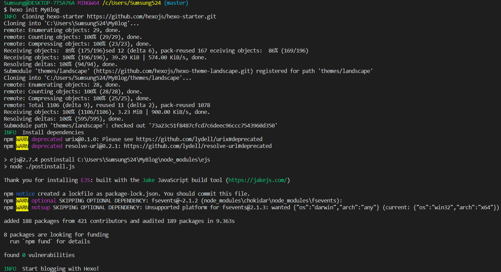

**hexo init**

等待运行完成，此时文件夹中多了许多文件。 注意：后续的命令均需要在站点目录下（即文件夹内）使用 Git Bash 运行。 此时 Hexo 框架的本地搭建已经完成了。我们来运行一下看看:

```bash
hexo s
```

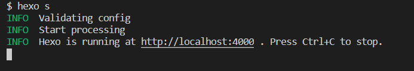

**hexo s**

浏览器中打开 [http://locakhost:4000](http://locakhost:4000/) 或者 127.0.0.1:4000，可以看到一个网页，说明 Hexo 博客已经成功在本地运行。

### [](https://xmq.plus/posts/2547c616.html#2-%E5%88%87%E6%8D%A2%E4%B8%BB%E9%A2%98 "2.切换主题")2.切换主题

-   解压下载好的`hexo-theme-matery`博客主题
    
-   将解压文件拷贝至`/Myblog/themes/`目录文件下，并重命名为`matery`
    
-   删除原有`landscape`主题（可不删除）
    
-   进入博客站点目录(`MyBlog/`)，用文本编辑器打开`_config.yml`（或者使用`Vim/vi`编辑文本）  
    `_config.yml` 是Hexo博客的全局配置文件，在以后的博客修改，如个性化修改，博客 SEO 优化等都会使用到
    
-   将文件中101行位置`theme`选项中的`landscape`主题命名为`matery`,保存并退出
    
    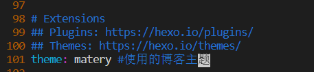
    
    **matery config**
    

重新`hexo cl && hexo g && hexo s`一次可看到切换主题成功

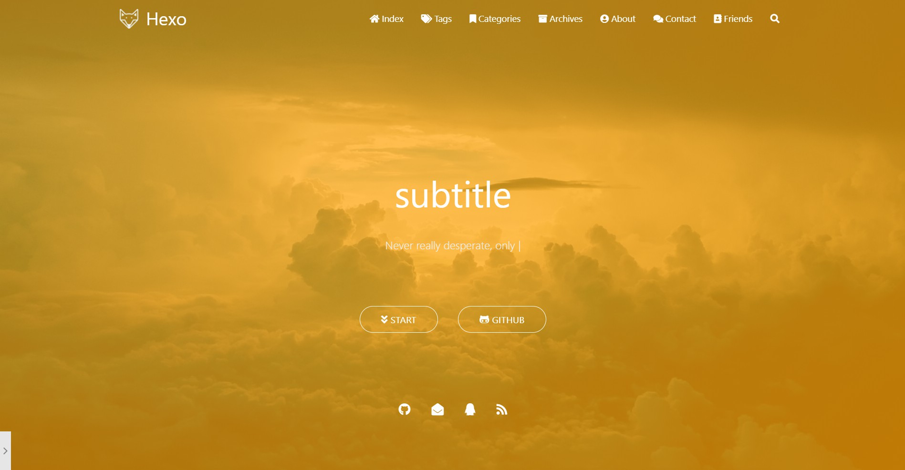

**切换主题**

到此，博客本地搭建完成，接下来定制和优化博客

### [](https://xmq.plus/posts/2547c616.html#3-%E9%83%A8%E7%BD%B2%E5%88%B0GitHub-pages "3.部署到GitHub pages")3.部署到GitHub pages

生成`SSH`添加到`GitHub`，连接`Github`与本地。  
右键打开`git bash`，然后输入下面命令：

```git
git config --global user.name "yourname"
git config --global user.email "youremail"
```

这里的`yourname`输入你的`GitHub`用户名，`youremail`输入你`GitHub`的邮箱。这样`GitHub`才能知道你是不是对应它的账户。可以用以下两条，检查一下你有没有输对

```git
git config user.name
git config user.email
```

然后创建`SSH`,一路回车

```git
ssh-keygen -t rsa -C "youremail"
```

这个时候它会告诉你已经生成了`.ssh`的文件夹。在你的电脑中找到这个文件夹。或者`git bash`中输入

```shell
cat ~/.ssh/id_rsa.pub
```

将输出的内容复制到框中，点击确定保存。

打开[github](http://github.com/)，在头像下面点击`settings`，再点击`SSH and GPG keys`，新建一个`SSH`，名字随便取一个都可以，把你的`id_rsa.pub`里面的信息复制进去。如图：

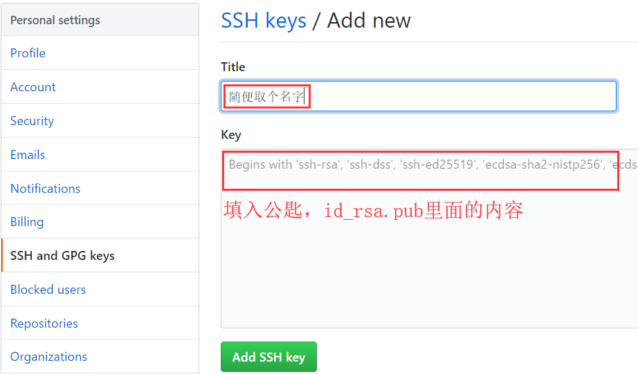

**img**

在`git bash`输入`ssh -T git@github.com`，如果如下图所示，出现你的用户名，那就成功了。

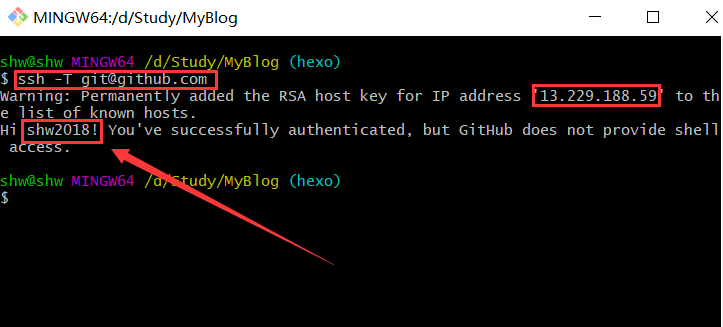

**img**

安装hexo部署到github pages工具

```bash
npm install hexo-deployer-git --save
```

然后

```bash
hexo clean
hexo generate
hexo deploy
```

其中 `hexo clean`清除了你之前生成的东西，也可以不加。 `hexo generate`顾名思义，生成静态文章，可以用 `hexo g`缩写 ，`hexo deploy`部署文章，可以用`hexo d`缩写

> 注意`deploy`时可能要你输入`username`和`password`。

## [](https://xmq.plus/posts/2547c616.html#%E5%9B%9B%E3%80%81%E5%9F%BA%E6%9C%AC%E5%AE%9A%E5%88%B6%E5%8D%9A%E5%AE%A2 "四、基本定制博客")四、基本定制博客

参照[Hexo-theme-mater_Readme.md](https://github.com/blinkfox/hexo-theme-matery/blob/develop/README_CN.md)对博客主题进行基本的设置：

### [](https://xmq.plus/posts/2547c616.html#1-%E5%88%9D%E5%A7%8B%E9%A1%B5%E9%9D%A2 "1.初始页面")1.初始页面

主题中带有的某些页面还未生成，不能正常打开，需要在`hexo`中先生成新建页面:

-   新建分类 categories 页

`categories` 页是用来展示所有分类的页面，如果在你的博客 `source` 目录下还没有 `categories/index.md` 文件，那么你就需要新建一个，命令如下：

```bash
hexo new page "categories"
```

编辑你刚刚新建的页面文件 `/source/categories/index.md`，至少需要以下内容：

```
---
title: categories
date: 2018-09-30 17:25:30
type: "categories"
layout: "categories"
---
```

-   新建标签 tags 页

`tags` 页是用来展示所有标签的页面，如果在你的博客 `source` 目录下还没有 `tags/index.md` 文件，那么你就需要新建一个，命令如下：

```bash
hexo new page "tags"
```

编辑你刚刚新建的页面文件 `/source/tags/index.md`，至少需要以下内容：

```
---
title: tags
date: 2018-09-30 18:23:38
type: "tags"
layout: "tags"
---
```

-   新建关于我 about 页

`about` 页是用来展示**关于我和我的博客**信息的页面，如果在你的博客 `source` 目录下还没有 `about/index.md` 文件，那么你就需要新建一个，命令如下：

```bash
hexo new page "about"
```

编辑你刚刚新建的页面文件 `/source/about/index.md`，至少需要以下内容：

```
---
title: about
date: 2018-09-30 17:25:30
type: "about"
layout: "about"
---
```

-   新建留言板 contact 页（可选的）

`contact` 页是用来展示**留言板**信息的页面，如果在你的博客 `source` 目录下还没有 `contact/index.md` 文件，那么你就需要新建一个，命令如下：

```bash
hexo new page "contact"
```

编辑你刚刚新建的页面文件 `/source/contact/index.md`，至少需要以下内容：

```
---
title: contact
date: 2018-09-30 17:25:30
type: "contact"
layout: "contact"
---
```

> **注**：本留言板功能依赖于第三方评论系统，请**激活**你的评论系统才有效果。并且在主题的 `_config.yml` 文件中，第 `19` 至 `21` 行的“**菜单**”配置，取消关于留言板的注释即可。

-   新建友情链接 friends 页（可选的）

`friends` 页是用来展示**友情链接**信息的页面，如果在你的博客 `source` 目录下还没有 `friends/index.md` 文件，那么你就需要新建一个，命令如下：

```bash
hexo new page "friends"
```

编辑你刚刚新建的页面文件 `/source/friends/index.md`，至少需要以下内容：

```
---
title: friends
date: 2018-12-12 21:25:30
type: "friends"
layout: "friends"
---
```

同时，在你的博客 `source` 目录下新建 `_data` 目录，在 `_data` 目录中新建 `friends.json` 文件，文件内容如下所示：

```js
[{
    "avatar": "http://image.luokangyuan.com/1_qq_27922023.jpg",
    "name": "码酱",
    "introduction": "我不是大佬，只是在追寻大佬的脚步",
    "url": "http://luokangyuan.com/",
    "title": "前去学习"
}, {
    "avatar": "http://image.luokangyuan.com/4027734.jpeg",
    "name": "闪烁之狐",
    "introduction": "编程界大佬，技术牛，人还特别好，不懂的都可以请教大佬",
    "url": "https://blinkfox.github.io/",
    "title": "前去学习"
}, {
    "avatar": "http://image.luokangyuan.com/avatar.jpg",
    "name": "ja_rome",
    "introduction": "平凡的脚步也可以走出伟大的行程",
    "url": "https://me.csdn.net/jlh912008548",
    "title": "前去学习"
}]
```

初始页面全部搞定，现在主题的页面都能正常打开了。

### [](https://xmq.plus/posts/2547c616.html#2-%E4%BB%A3%E7%A0%81%E7%AE%80%E5%8C%96%E4%B8%8E%E5%9F%BA%E6%9C%AC%E9%85%8D%E7%BD%AE "2.代码简化与基本配置")2.代码简化与基本配置

好处：简化代码，剔除不适用不必要的功能，提高可读性，方便后期调整和他人学习。

#### [](https://xmq.plus/posts/2547c616.html#Hexo%E5%85%A8%E5%B1%80%E9%85%8D%E7%BD%AE%E4%BC%98%E5%8C%96 "Hexo全局配置优化")`Hexo`全局配置优化

```yml
# 站点
title: 肆零肆 #网站标题
subtitle: '肆零肆  | 学习记录' #网站副标题
description: '' #网站描述
keywords: #关键词，seo优化
author: Sumsung #作者
language: zh-CN #语言
timezone: '' #时区

# URL
## 如果你的网站不是放在网站根目录下，将URL设置为'http://yoursite.com/child'；root： '/child/'
url: http://yoursite.com
root: /
permalink: :year/:month/:day/:title/
permalink_defaults:
pretty_urls:
  trailing_index: false # 是否在永久链接中保留尾部的 index.html，设置为 false 时去除
  trailing_html: false # 是否在永久链接中保留尾部的.html, 设置为false时去除(对尾部的index.html无效)

# 目录
source_dir: source
public_dir: public
tag_dir: tags
archive_dir: archives
category_dir: categories
code_dir: downloads/code
i18n_dir: :lang
skip_render:

# 文章
new_post_name: :title.md # 新建博客文章名称
default_layout: post #默认写作布置
titlecase: false # 把标题转换为 title case
external_link:
  enable: true # 在新标签中打开链接
  field: site 
  exclude: '' #需要排除的域名。主域名和子域名如 www 需分别配置
filename_case: 0
render_drafts: false
post_asset_folder: false
relative_link: false
future: true
highlight:
  enable: true
  line_number: true
  auto_detect: false
  tab_replace: ''
  wrap: true
  hljs: false
prismjs:
  enable: false
  preprocess: true
  line_number: true
  tab_replace: ''

#主页设置
# path:博客首页的根目录 (默认 = '')
# per_page: 每页显示的博客文章数量. (0 = 关闭分页功能)
# order_by: Posts order. (Order by date descending by default)
index_generator:
  path: ''
  per_page: 10
  order_by: -date

# "分类"和"标签"页
default_category: uncategorized
category_map:
tag_map:

meta_generator: true

# 日期/时间格式
## 详情:http://momentjs.com/docs/#/displaying/format/
date_format: YYYY-MM-DD
time_format: HH:mm:ss
updated_option: 'mtime'

# 分页
per_page: 10 # 0 = 关闭分页功能
pagination_dir: page

# Include / Exclude file(s) include:/exclude: options only apply to the 'source/' folder
include:
exclude:
ignore:

# 扩展
## 插件访问: https://hexo.io/plugins/
## 主题访问: https://hexo.io/themes/
theme: matery #使用的博客主题

# 部署
## 部署访问: https://hexo.io/docs/one-command-deployment
deploy:
  type: ''
```

> Hexo官方全局设置说明文档：[Hexo.io](https://hexo.io/zh-cn/docs/configuration.html)

#### [](https://xmq.plus/posts/2547c616.html#Hexo%E4%B8%BB%E9%A2%98%E5%85%A8%E5%B1%80%E9%85%8D%E7%BD%AE%E6%96%87%E4%BB%B6-config-yml%E4%BC%98%E5%8C%96 "Hexo主题全局配置文件_config.yml优化")`Hexo`主题全局配置文件`_config.yml`优化

主要的操作有：

-   菜单导航配置

菜单导航名称可以是中文也可以是英文(如：`Index`或`主页`)

```yml
# 二级菜单写法如下
  Medias:
    icon: fas fa-list
    children:
      - name: Musics
        url: /musics
        icon: fas fa-music
      - name: Movies
        url: /movies
        icon: fas fa-film
      - name: Books
        url: /books
        icon: fas fa-book
      - name: Galleries
        url: /galleries
        icon: fas fa-image
```

-   配置基本菜单导航的名称、路径url和图标icon.

图标icon 可以在[Font Awesome](https://fontawesome.com/icons) 中查找

### [](https://xmq.plus/posts/2547c616.html#3-%E5%88%A0%E9%99%A4%E6%97%A0%E7%94%A8%E6%96%87%E4%BB%B6 "3.删除无用文件")3.删除无用文件

-   /themes/matery/Readme.md
-   /themes/matery/README_CN.md
-   /themes/matery/LICENSE
-   /layout/_partial/github-link.ejs
-   sources/libs/others/busuanzi.pure.mini.js
-   /layout/_partial/gitalk.ejs
-   /layout/_partial/gitment.ejs
-   /layout/_partial/gitment.ejs
-   /layout/_partial/disqus.ejs
-   /layout/_partial/livere.ejs
-   /layout/_partial/minivaline.ejs

### [](https://xmq.plus/posts/2547c616.html#4-%E6%8F%92%E4%BB%B6%E5%AE%89%E8%A3%85%E5%8F%8A%E9%85%8D%E7%BD%AE "4.插件安装及配置")4.插件安装及配置

#### [](https://xmq.plus/posts/2547c616.html#%E4%BB%A3%E7%A0%81%E9%AB%98%E4%BA%AE "代码高亮")代码高亮

由于 Hexo 自带的代码高亮主题显示不好看，所以主题中使用到了 [hexo-prism-plugin](https://github.com/ele828/hexo-prism-plugin) 的 Hexo 插件来做代码高亮，安装命令如下：

```bash
npm i -S hexo-prism-plugin
```

然后，修改 Hexo 根目录下 `_config.yml` 文件中 `highlight.enable` 的值为 `false`，并新增 `prism` 插件相关的配置，主要配置如下：

```yml
highlight:
  enable: false

prism_plugin:
  mode: 'preprocess'    # realtime/preprocess
  theme: 'tomorrow'
  line_number: false    # default false
  custom_css:
```

### [](https://xmq.plus/posts/2547c616.html#%E4%BF%AE%E5%A4%8D%E4%BB%A3%E7%A0%81%E5%9D%97%E8%A1%8C%E5%8F%B7%E4%B8%8D%E6%98%BE%E7%A4%BAbug "修复代码块行号不显示bug")修复代码块行号不显示bug

修改`themes/matery/source/css/matery.css`第95行左右的`pre`和`code`两段改为如下代码：

```css
pre {
    /* padding: 1.5rem !important; */
    padding: 1.5rem 1.5rem 1.5rem 3.3rem !important;
    margin: 1rem 0 !important;
    background: #272822;
    overflow: auto;
    border-radius: 0.35rem;
    tab-size: 4;
}

code {
    padding: 1px 5px;
    font-family: Inconsolata, Monaco, Consolas, 'Courier New', Courier, monospace;
    /* font-size: 0.91rem; */
    color: #e96900;
    background-color: #f8f8f8;
    border-radius: 2px;
}
```

Css

然后在根目录的`_config.yml`中设置`prism_plugin.line_number`为`true`

#### [](https://xmq.plus/posts/2547c616.html#%E6%90%9C%E7%B4%A2 "搜索")搜索

本主题中还使用到了 [hexo-generator-search](https://github.com/wzpan/hexo-generator-search) 的 Hexo 插件来做内容搜索，安装命令如下：

```bash
npm install hexo-generator-search --save
```

在 Hexo 根目录下的 `_config.yml` 文件中，新增以下的配置项：

```yml
search:
  path: search.xml
  field: post
```

#### [](https://xmq.plus/posts/2547c616.html#%E6%96%87%E7%AB%A0%E5%AD%97%E6%95%B0%E7%BB%9F%E8%AE%A1%E6%8F%92%E4%BB%B6 "文章字数统计插件")文章字数统计插件

如果你想要在文章中显示文章字数、阅读时长信息，可以安装 [hexo-wordcount](https://github.com/willin/hexo-wordcount)插件。

安装命令如下：

```bash
npm i --save hexo-wordcount
```

然后只需在本主题下的 `_config.yml` 文件中，将各个文章字数相关的配置激活即可：

```yml
postInfo:
  date: true
  update: false
  wordCount: false # 设置文章字数统计为 true.
  totalCount: false # 设置站点文章总字数统计为 true.
  min2read: false # 阅读时长.
  readCount: false # 阅读次数.
```

#### [](https://xmq.plus/posts/2547c616.html#%E5%85%B6%E4%BB%96 "其他")其他

-   添加emoji表情支持（可选的）

本主题新增了对`emoji`表情的支持，使用到了 [hexo-filter-github-emojis](https://npm.taobao.org/package/hexo-filter-github-emojis) 的 Hexo 插件来支持 `emoji`表情的生成，把对应的`markdown emoji`语法（`::`,例如：`:smile:`）转变成会跳跃的`emoji`表情，安装命令如下：

```yml
npm install hexo-filter-github-emojis --save
```

在 Hexo 根目录下的 `_config.yml` 文件中，新增以下的配置项：

```yml
githubEmojis:
  enable: true
  className: github-emoji
  inject: true
  styles:
  customEmojis:
```

-   添加 RSS 订阅支持（可选的）

本主题中还使用到了 [hexo-generator-feed](https://github.com/hexojs/hexo-generator-feed) 的 Hexo 插件来做 `RSS`，安装命令如下：

```bash
npm install hexo-generator-feed --save
```

在 Hexo 根目录下的 `_config.yml` 文件中，新增以下的配置项：

```yml
feed:
  type: atom
  path: atom.xml
  limit: 20
  hub:
  content:
  content_limit: 140
  content_limit_delim: ' '
  order_by: -date
```

执行 `hexo clean && hexo g` 重新生成博客文件，然后在 `public` 文件夹中即可看到 `atom.xml` 文件，说明你已经安装成功了。

-   中文链接转拼音（建议安装）

如果你的文章名称是中文的，那么 Hexo 默认生成的永久链接也会有中文，这样不利于 `SEO`，且 `gitment` 评论对中文链接也不支持。我们可以用 [hexo-permalink-pinyin](https://github.com/viko16/hexo-permalink-pinyin) Hexo 插件使在生成文章时生成中文拼音的永久链接。

安装命令如下：

```bash
npm i hexo-permalink-pinyin --save
```

在 Hexo 根目录下的 `_config.yml` 文件中，新增以下的配置项：

```yml
permalink_pinyin:
  enable: true
  separator: '-' # default: '-'
```

> **注**：除了此插件外，[hexo-abbrlink](https://github.com/rozbo/hexo-abbrlink) 插件也可以生成非中文的链接。

-   添加 [DaoVoice](http://www.daovoice.io/) 在线聊天功能（可选的）

前往 [DaoVoice](http://www.daovoice.io/) 官网注册并且获取 `app_id`，并将 `app_id` 填入主题的 `_config.yml` 文件中。

-   添加 [Tidio](https://www.tidio.com/) 在线聊天功能（可选的）

前往 [Tidio](https://www.tidio.com/) 官网注册并且获取 `Public Key`，并将 `Public Key` 填入主题的 `_config.yml` 文件中。

## [](https://xmq.plus/posts/2547c616.html#%E4%BA%94%E3%80%81%E6%B7%B1%E5%85%A5%E5%AE%9A%E5%88%B6%E5%8D%9A%E5%AE%A2 "五、深入定制博客")五、深入定制博客

#### [](https://xmq.plus/posts/2547c616.html#%E4%BF%AE%E6%94%B9%E9%A6%96%E9%A1%B5%E5%BC%80%E5%A7%8B%E9%98%85%E8%AF%BB%E5%AD%97%E6%A0%B7 "修改首页开始阅读字样")修改首页开始阅读字样

打开`index-cover.ejs`修改字段为`<%= theme.indexbtn.index %>`：

```js
<a href="#indexCard" class="waves-effect waves-light btn">
    <i class="fa fa-angle-double-down"></i><%= theme.indexbtn.index %>
</a>
```

并在主题配置文件中加入indexbtn选项下添加index选项：

```yml
indexbtn:
  enable: true
  index: 学习记录
  name: 导航网站
  icon: fas fa-location-arrow
  url: /navigation
```

#### [](https://xmq.plus/posts/2547c616.html#%E6%9B%B4%E6%94%B9Logo%E5%8F%8A%E8%83%8C%E6%99%AF%E5%9B%BE%E7%89%87 "更改Logo及背景图片")更改Logo及背景图片

-   更改网站标题LOGO  
    替换MyBolg/themes/matery/source/favicon.png
    
-   更改网页LOGO  
    替换MyBolg/themes/matery/source/medias/logo.png
    
-   更改关于页面头像  
    将主题文件下_config.yml中设置`avatar:/medias/avatar.png`替换MyBolg/themes/matery/source/medias/avatar.png
    
-   更改网页背景图片
    
    替换MyBolg/themes/matery/source/medias/banner中图片
    
-   更改特征图
    
    替换MyBolg/themes/matery/source/medias/featureimages中图片
    
-   更改打赏二维码
    
    替换MyBolg/themes/matery/source/medias/reward中图片
    

#### [](https://xmq.plus/posts/2547c616.html#%E4%BF%AE%E6%94%B9%E4%B8%BB%E9%A2%98%E9%A2%9C%E8%89%B2 "修改主题颜色")修改主题颜色

在主题文件的 `/source/css/matery.css` 文件中，搜索 `.bg-color` 来修改背景颜色：

```css
/* 整体背景颜色，包括导航、移动端的导航、页尾、标签页等的背景颜色.将渐变改成单色 */
.bg-color {
    background-image: linear-gradient(to right, #000000 0%, #000000 100%);
}

/*使用/**/屏蔽代码或直接删除代码，关闭背景图片滤镜效果*/

/*@-webkit-keyframes rainbow {

    0%,
    100% {
        background: rgba(156, 39, 176, 0.75);
        background: linear-gradient(45deg, rgba(156, 39, 176, 0.75) 0%, rgba(156, 39, 176, 0.65) 100%);
        background: -moz-linear-gradient(135deg, rgba(156, 39, 176, 0.75) 0%, rgba(156, 39, 176, 0.65) 100%);
        background: -webkit-linear-gradient(135deg, rgba(156, 39, 176, 0.75) 0%, rgba(156, 39, 176, 0.65) 100%);
    }

    16% {
        background: rgba(132, 13, 121, 0.75);
        background: linear-gradient(45deg, rgba(132, 13, 121, 0.75) 0%, rgba(132, 13, 121, 0.65) 100%);
        background: -moz-linear-gradient(135deg, rgba(132, 13, 121, 0.75) 0%, rgba(132, 13, 121, 0.65) 100%);
        background: -webkit-linear-gradient(135deg, rgba(132, 13, 121, 0.75) 0%, rgba(132, 13, 121, 0.65) 100%);
    }

    32% {
        background: rgba(239, 83, 80, 0.75);
        background: linear-gradient(45deg, rgba(239, 83, 80, 0.75) 0%, rgba(239, 83, 80, 0.65) 100%);
        background: -moz-linear-gradient(135deg, rgba(239, 83, 80, 0.75) 0%, rgba(239, 83, 80, 0.65) 100%);
        background: -webkit-linear-gradient(135deg, rgba(239, 83, 80, 0.75) 0%, rgba(239, 83, 80, 0.65) 100%);
    }

    48% {
        background: rgba(255, 87, 34, 0.75);
        background: linear-gradient(45deg, rgba(255, 87, 34, 0.75) 0%, rgba(255, 87, 34, 0.65) 100%);
        background: -moz-linear-gradient(135deg, rgba(255, 87, 34, 0.75) 0%, rgba(255, 87, 34, 0.65) 100%);
        background: -webkit-linear-gradient(135deg, rgba(255, 87, 34, 0.75) 0%, rgba(255, 87, 34, 0.65) 100%);
    }

    64% {
        background: rgba(255, 160, 0, 0.75);
        background: linear-gradient(45deg, rgba(255, 160, 0, 0.75) 0%, rgba(255, 160, 0, 0.65) 100%);
        background: -moz-linear-gradient(135deg, rgba(255, 160, 0, 0.75) 0%, rgba(255, 112, 66, 0.65) 100%);
        background: -webkit-linear-gradient(135deg, rgba(255, 160, 0, 0.75) 0%, rgba(255, 160, 0, 0.65) 100%);
    }

    80% {
        background: rgba(233, 30, 99, 0.75);
        background: linear-gradient(45deg, rgba(233, 30, 99, 0.75) 0%, rgba(233, 30, 99, 0.65) 100%);
        background: -moz-linear-gradient(135deg, rgba(233, 30, 99, 0.75) 0%, rgba(233, 30, 99, 0.65) 100%);
        background: -webkit-linear-gradient(135deg, rgba(2233, 30, 99, 0.75) 0%, rgba(233, 30, 99, 0.65) 100%);
    }
}

@keyframes rainbow {

    0%,
    100% {
        background: rgba(156, 39, 176, 0.75);
        background: linear-gradient(45deg, rgba(156, 39, 176, 0.75) 0%, rgba(156, 39, 176, 0.65) 100%);
        background: -moz-linear-gradient(135deg, rgba(156, 39, 176, 0.75) 0%, rgba(156, 39, 176, 0.65) 100%);
        background: -webkit-linear-gradient(135deg, rgba(156, 39, 176, 0.75) 0%, rgba(156, 39, 176, 0.65) 100%);
    }

    16% {
        background: rgba(132, 13, 121, 0.75);
        background: linear-gradient(45deg, rgba(132, 13, 121, 0.75) 0%, rgba(132, 13, 121, 0.65) 100%);
        background: -moz-linear-gradient(135deg, rgba(132, 13, 121, 0.75) 0%, rgba(132, 13, 121, 0.65) 100%);
        background: -webkit-linear-gradient(135deg, rgba(132, 13, 121, 0.75) 0%, rgba(132, 13, 121, 0.65) 100%);
    }

    32% {
        background: rgba(239, 83, 80, 0.75);
        background: linear-gradient(45deg, rgba(239, 83, 80, 0.75) 0%, rgba(239, 83, 80, 0.65) 100%);
        background: -moz-linear-gradient(135deg, rgba(239, 83, 80, 0.75) 0%, rgba(239, 83, 80, 0.65) 100%);
        background: -webkit-linear-gradient(135deg, rgba(239, 83, 80, 0.75) 0%, rgba(239, 83, 80, 0.65) 100%);
    }

    48% {
        background: rgba(255, 87, 34, 0.75);
        background: linear-gradient(45deg, rgba(255, 87, 34, 0.75) 0%, rgba(255, 87, 34, 0.65) 100%);
        background: -moz-linear-gradient(135deg, rgba(255, 87, 34, 0.75) 0%, rgba(255, 87, 34, 0.65) 100%);
        background: -webkit-linear-gradient(135deg, rgba(255, 87, 34, 0.75) 0%, rgba(255, 87, 34, 0.65) 100%);
    }

    64% {
        background: rgba(255, 160, 0, 0.75);
        background: linear-gradient(45deg, rgba(255, 160, 0, 0.75) 0%, rgba(255, 160, 0, 0.65) 100%);
        background: -moz-linear-gradient(135deg, rgba(255, 160, 0, 0.75) 0%, rgba(255, 112, 66, 0.65) 100%);
        background: -webkit-linear-gradient(135deg, rgba(255, 160, 0, 0.75) 0%, rgba(255, 160, 0, 0.65) 100%);
    }

    80% {
        background: rgba(233, 30, 99, 0.75);
        background: linear-gradient(45deg, rgba(233, 30, 99, 0.75) 0%, rgba(233, 30, 99, 0.65) 100%);
        background: -moz-linear-gradient(135deg, rgba(233, 30, 99, 0.75) 0%, rgba(233, 30, 99, 0.65) 100%);
        background: -webkit-linear-gradient(135deg, rgba(2233, 30, 99, 0.75) 0%, rgba(233, 30, 99, 0.65) 100%);
    }
}*/
```

#### [](https://xmq.plus/posts/2547c616.html#%E8%AE%BE%E7%BD%AE%E9%9A%90%E8%97%8F%E7%9A%84%E8%83%8C%E6%99%AF%E9%A2%9C%E8%89%B2 "设置隐藏的背景颜色")设置隐藏的背景颜色

文件位于：MyBlog\themes\matery\source\libs\materialize/materialize.min.css查找`.red{background-color:#F44336 !important}`将{}中的background-color删除或修改颜色

```css
.red{background-color:#335a91 !important}
```

#### [](https://xmq.plus/posts/2547c616.html#%E5%85%B3%E9%97%AD%E5%B0%81%E9%9D%A2%E5%9B%BE%E8%BD%AE%E6%92%AD "关闭封面图轮播")关闭封面图轮播

主题文件`_config.yml`中设置：

```yml
# 首页封面轮播图的相关配置.
cover:
  showPrevNext: false # 是否显示左右切换按钮.
  showIndicators: false # 是否显示指示器.
  autoLoop: false # 是否自动轮播.
  duration: 120 # 切换延迟时间.
  intervalTime: 5000 # 自动切换下一张的间隔时间.
  useConfig: false # 是否使用配置文件, 在 _data/covers.json 下配置推荐文章, false则使用主题在文章中的配置 cover coverImg
  # useConfig 使用方式: 将主题 hexo-theme-matery/source/_data/covers.json 移动到 my-blog/source/_data/下修改配置即可
```

#### [](https://xmq.plus/posts/2547c616.html#%E5%85%B3%E9%97%AD%E6%AF%8F%E6%97%A5%E5%88%87%E6%8D%A2banner "关闭每日切换banner")关闭每日切换banner

```yml
# banner 是否每日切换.
banner:
  enable: false # 若为 false, 则 banner 默认为 /medias/banner/0.jpg
```

#### [](https://xmq.plus/posts/2547c616.html#%E4%BF%AE%E6%94%B9-banner-%E5%9B%BE%E5%92%8C%E6%96%87%E7%AB%A0%E7%89%B9%E8%89%B2%E5%9B%BE "修改 banner 图和文章特色图")修改 banner 图和文章特色图

`banner` 中的图片主题代码中是每天动态切换一张，只需 `7` 张即可。如果你会 `JavaScript` 代码，可以修改成你自己喜欢切换逻辑，如：随机切换等，`banner` 切换的代码位置在 `/layout/_partial/bg-cover-content.ejs` 文件的 `<script></script>` 代码中：

```js
$('.bg-cover').css('background-image', 'url(/medias/banner/' + new Date().getDay() + '.jpg)');
```

在 `/source/medias/featureimages` 文件夹中默认有 24 张特色图片，你可以再增加或者减少，并需要在 `_config.yml` 做同步修改。

#### [](https://xmq.plus/posts/2547c616.html#%E4%BF%AE%E6%94%B9%E7%A4%BE%E4%BA%A4%E9%93%BE%E6%8E%A5 "修改社交链接")修改社交链接

在主题的 `_config.yml` 文件中，默认支持 `QQ`、`GitHub` 和邮箱等的配置，你可以在主题文件的 `/layout/_partial/social-link.ejs` 文件中，新增、修改你需要的社交链接地址，增加链接可参考如下代码：

```html
<% if (theme.socialLink.github) { %>
    <a href="<%= theme.socialLink.github %>" class="tooltipped" target="_blank" data-tooltip="访问我的GitHub" data-position="top" data-delay="50">
        <i class="fab fa-github"></i>
    </a>
<% } %>
```

现仅对内容进行删减，主题全局配置文件下设置仅仅留下QQ、Github、邮箱，同时关闭FORK ME：

```yml
socialLink:
  github:  https://github.com/Sumsung524
  email: me@xiongmengqi.top
  facebook: # https://www.facebook.com/xxx
  twitter: # https://twitter.com/xxx
  qq: 985247777
  weibo: # https://weibo.com/xxx
  zhihu: # https://www.zhihu.com/xxx
  rss: false # true、false

githubLink:
  enable: false
  url: https://github.com/Sumsung524
  title: Fork Me #或者直接删除
```

> githubLink的设置在`/layout/_partial/github-link.ejs`中，关闭之后，可以直接移除github-link.ejs，如果以后需要设置其他形式的按键，可重新移入并在主题全局配置文件中设置

`/layout/_partial/social-link.ejs` 文件设置邮箱显示内容为自己邮箱：

```js
<% if (theme.socialLink.github) { %>
    <a href="<%= theme.socialLink.github %>" class="tooltipped" target="_blank" data-tooltip="访问我的GitHub" data-position="top" data-delay="50">
        <i class="fab fa-github"></i>
    </a>
<% } %>
<% if (theme.socialLink.email) { %>
    <a href="mailto:<%= theme.socialLink.email %>" class="tooltipped" target="_blank" data-tooltip="me@xiongmengqi.top" data-position="top" data-delay="50">
        <i class="fas fa-envelope-open"></i>
    </a>
<% } %>
<% if (theme.socialLink.qq) { %>
    <a href="tencent://AddContact/?fromId=50&fromSubId=1&subcmd=all&uin=<%= theme.socialLink.qq %>" class="tooltipped" target="_blank" data-tooltip="QQ:<%= theme.socialLink.qq %>" data-position="top" data-delay="50">
        <i class="fab fa-qq"></i>
    </a>
<% } %>
```

#### [](https://xmq.plus/posts/2547c616.html#%E4%BF%AE%E6%94%B9%E9%A1%B5%E8%84%9A "修改页脚")修改页脚

修改页脚的地方在主题文件的 `/layout/_partial/footer.ejs` 文件中，包括站点、使用的主题、访问量等。

-   在`_config.yml`打开站点运行时间记录功能:

```yml
time:
  enable: true
  year: 2020 # 年份
  month: 08 # 月份
  date: 20 # 日期
  hour: 00 # 小时
  minute: 00 # 分钟
  second: 00 # 秒
```

去除小时、分钟、秒消掉：

将 `+ diffHours +" 小时 " + diffMinutes + " 分钟 " + diffSeconds + " 秒"`字段删除

-   关闭运行时间记录，有需要的时候再开启

在主题文件中删除上述代码，删除`/layout/_partial/footer.ejs`中相关函数

-   删除[不蒜子](http://busuanzi.ibruce.info/) 网站统计代码：

主题配置文件中删除：

```yml
# busuanzi(http://busuanzi.ibruce.info/) website statistics
# 不蒜子(http://busuanzi.ibruce.info/) 网站统计
busuanziStatistics:
  enable: true
  totalTraffic: true # 总访问量
  totalNumberOfvisitors: true # 总人次

  busuanzi: /libs/others/busuanzi.pure.mini.js
```

在主题文件中删除不蒜子相关代码，删除`/layout/_partial/footer.ejs`中相关函数：

```js
<% if (theme.postInfo.totalCount) { %>
&nbsp;<i class="fas fa-chart-area"></i>&nbsp;站点总字数:&nbsp;<span
    class="white-color"><%= totalcount(site) %></span>&nbsp;字
<% } %>
<% let socialClass = '' %>
<% if (theme.busuanziStatistics && theme.busuanziStatistics.enable) { %>
<% socialClass = 'social-statis' %>
<% } %>
<% if (theme.busuanziStatistics && theme.busuanziStatistics.totalTraffic) { %>
            <span id="busuanzi_container_site_pv">
                |&nbsp;<i class="far fa-eye"></i>&nbsp;总访问量:&nbsp;<span id="busuanzi_value_site_pv"
                    class="white-color"></span>&nbsp;次
            </span>
            <% } %>
            <% if (theme.busuanziStatistics && theme.busuanziStatistics.totalNumberOfvisitors) { %>
            <span id="busuanzi_container_site_uv">
                |&nbsp;<i class="fas fa-users"></i>&nbsp;总访问人数:&nbsp;<span id="busuanzi_value_site_uv"
        class="white-color"></span>&nbsp;人
</span>
<% } %>
<br>
<% if (theme.time.enable) { %>
<span id="sitetime">载入运行时间...</span>
<script>
function siteTime() {
   var seconds = 1000;
   var minutes = seconds * 60;
   var hours = minutes * 60;
   var days = hours * 24;
   var years = days * 365;
   var today = new Date();
   var startYear = "<%- theme.time.year %>";
   var startMonth = "<%- theme.time.month %>";
   var startDate = "<%- theme.time.date %>";
   var startHour = "<%- theme.time.hour %>";
   var startMinute = "<%- theme.time.minute %>";
   var startSecond = "<%- theme.time.second %>";
   var todayYear = today.getFullYear();
   var todayMonth = today.getMonth() + 1;
   var todayDate = today.getDate();
   var todayHour = today.getHours();
   var todayMinute = today.getMinutes();
   var todaySecond = today.getSeconds();
   var t1 = Date.UTC(startYear, startMonth, startDate, startHour, startMinute, startSecond);
                    var t2 = Date.UTC(todayYear, todayMonth, todayDate, todayHour, todayMinute, todaySecond);
var diff = t2 - t1;
var diffYears = Math.floor(diff / years);
var diffDays = Math.floor((diff / days) - diffYears * 365);
var diffHours = Math.floor((diff - (diffYears * 365 + diffDays) * days) / hours);
var diffMinutes = Math.floor((diff - (diffYears * 365 + diffDays) * days - diffHours * hours) /
                        minutes);
var diffSeconds = Math.floor((diff - (diffYears * 365 + diffDays) * days - diffHours * hours -
    diffMinutes * minutes) / seconds);
if (startYear == todayYear) {
    document.getElementById("year").innerHTML = todayYear;
    document.getElementById("sitetime").innerHTML = "本站已运行 " + diffDays + " 天 ";
} else {
document.getElementById("year").innerHTML = startYear + " - " + todayYear;
document.getElementById("sitetime").innerHTML = "本站已运行 " + diffYears + " 年 " + diffDays +
" 天 ";
}
    }
    setInterval(siteTime, 1000);
</script>
<% } %>
<br>
```

**注意：**

删除此段代码会出现部署问题，由于layout.ejs中设置过此函数，此函数删除而找不到会发生无法部署的错误。

因此，需要删除`matery/layout/layout.ejs`中字段：

```js
    <% if (theme.busuanziStatistics && theme.busuanziStatistics.enable) { %>
    <script async src="<%- theme.jsDelivr.url %><%- url_for(theme.libs.js.busuanzi) %>"></script>
    <% } %>
```

按照代码提示`footer.ejs`中`socialClass is not defined`可以直接将`<%- socialClass %>`字段删除或者使用其他CSS样式，删除后再加上`<br>`：

```html
<div class="col s12 m4 l4 social-link <%- socialClass %>"><%- partial('_partial/social-link') %></div>
```

> layout.ejs用于设置布局，告诉网站解析时引用什么样的文件、脚本、函数等等，属于一个大体的框架文件，表达了整个网站的大致结构。

如备案信息不需要填写，可直接删除字段：

```js
<% if (theme.icp.enable) { %>
    <span id="icp"><%- url_for('/medias/icp.png') %>" style="vertical-align: text-bottom;" />
        <a href="<%- url_for(theme.icp.url) %>" target="_blank"><%= theme.icp.text %></a>
                          </span>
                          <% } %>
```

删除主题配置文件中：

```yml
#ICP备案信息尾部显示
icp:
  enable: false
  url: # 备案链接
  text: # 备案信息
```

最好删除：`sources/libs/others/busuanzi.pure.mini.js`

删除之后即可重新成功部署。

-   将页脚变成窄边框

在sources/libs/materialize/materialize.min.css中查找`.page-footer`，找到`.page-footer{padding-top:20px;color:#666;background-color:#ee6e73}`删除`padding-top:20px;`

-   修改页脚字体颜色

source/css/matery.css中搜索`footer .copy-right {`、`footer a {color: #999;}`将颜色修改:

```css
footer a {
    color: #999;
}
footer .copy-right {
    color: #444;
}
```

#### [](https://xmq.plus/posts/2547c616.html#%E4%BF%AE%E6%94%B9%E6%96%87%E7%AB%A0%E5%8D%A1%E7%89%87%E4%B8%AD%E6%A0%87%E7%AD%BE%E9%A2%9C%E8%89%B2 "修改文章卡片中标签颜色")修改文章卡片中标签颜色

在主题目录layout/matery.css中加入样式：

```css
.tag-color {
    background-image: linear-gradient(to left, #00c9ff 0%, #66a6ff 100%);
}
```

打开layout/index.ejs中使用Ctrl+F搜索`bg-color`，替换为：`tag-color`，从而实现标签颜色与导航条颜色独立。

#### [](https://xmq.plus/posts/2547c616.html#%E5%AE%9A%E5%88%B6%E5%9B%9E%E5%88%B0%E9%A1%B6%E9%83%A8 "定制回到顶部")定制回到顶部

-   修改回到顶部按钮颜色

source/css/matery.css中搜索`.top-scroll .btn-floating {`:

```css
.top-scroll .btn-floating {
    background: linear-gradient(to bottom right, #00c8fe 0%, #66a6ff 100%);
    width: 48px;
    height: 48px;
}
```

#### [](https://xmq.plus/posts/2547c616.html#%E5%8D%9A%E5%AE%A2%E6%96%87%E7%AB%A0%E8%8F%9C%E5%8D%95%E6%8C%89%E9%92%AE%E8%B0%83%E5%B0%8F "博客文章菜单按钮调小")博客文章菜单按钮调小

通过谷歌浏览器开发者模式定位到按钮样式，打开`/layout/_partial/post-details-toc.ejs`,Ctrl+F输入`#floating-toc-btn .btn-floating` ，修改样式：

```css
#floating-toc-btn .btn-floating {
    width: 32px;
    height: 32px;
}
#floating-toc-btn .btn-floating i {
    line-height: 48px;
    font-size: 1.2rem;
    position: absolute;
    bottom: -8px;
    left: 0px;
}
```

> position：absolute表示设置绝对定位，一般配bai合“top”和“left”属性同时使用进行定位

#### [](https://xmq.plus/posts/2547c616.html#%E4%BF%AE%E6%94%B9%E5%8D%9A%E5%AE%A2%E6%96%87%E7%AB%A0%E7%9B%AE%E5%BD%95%E9%A2%9C%E8%89%B2 "修改博客文章目录颜色")修改博客文章目录颜色

通过谷歌浏览器开发者模式定位到按钮样式，打开`/layout/_partial/post-details-toc.ejs`,Ctrl+F输入`#toc-content .is-active-link` ，修改样式：

```css
#toc-content .is-active-link {
    color: #66a6ff;
}
```

通过谷歌浏览器开发者模式定位到按钮样式，打开`/layout/_partial/post-details-toc.ejs`,Ctrl+F输入`#toc-content .toc-link:hover`，修改样式：

```css
#toc-content .toc-link:hover {
    color: #66a6ff;
    font-weight: 700;
    text-decoration: underline;
}
```

#### [](https://xmq.plus/posts/2547c616.html#%E4%BF%AE%E6%94%B9%E6%96%87%E7%AB%A0%E9%93%BE%E6%8E%A5%E9%A2%9C%E8%89%B2 "修改文章链接颜色")修改文章链接颜色

/source/css/matery.css:

```css
#articleContent a {
    padding: 0 2px;
    color: #66a6ff;
    font-weight: 500;
    text-decoration: underline;
    word-wrap: break-word;
}
```

```css
blockquote {
    border-left: 5px solid #66a6ff;
    padding: 1rem 0.8rem 0.2rem 0.8rem;
    color: #666;
    background-color: rgba(66, 185, 131, .1);
}
// 修改引用左侧竖线颜色
```

#### [](https://xmq.plus/posts/2547c616.html#%E5%AE%9A%E5%88%B6%E8%BF%9B%E5%BA%A6%E6%9D%A1 "定制进度条")定制进度条

-   更改底栏进度条色彩

source/css/matery.css中搜索`.progress-bar {`并设置:

```css
.progress-bar {
   height: 4px;
   position: fixed;
   bottom: 0px;
   z-index: 300;
   background: linear-gradient(to right, #4285f4 0%,  #ea4335 75%, #fbbc05 80%, #4285f4 85%, #34a853 90%, #ea4335 100%);
   opacity: 1.0;
}
```

-   更改浏览器默认的进度条样式

source/css/matery.css中最后添加：

考虑到进度条重复，故将width设置为0.1px隐藏导航条，方便以后需要时调用：

```css
  /* 定义滚动条样式 */

  ::-webkit-scrollbar {

    width: 0.1px;

    height: 6px;

    background-color: rgba(240, 240, 240, 0);

  }


  /*定义滚动条轨道 内阴影+圆角*/

  ::-webkit-scrollbar-track {

    box-shadow: inset 0 0 0px rgba(240, 240, 240, .5);

    border-radius: 7px;

    background-color: rgba(240, 240, 240, .5);

  }


  /*定义滑块 内阴影+圆角*/

  ::-webkit-scrollbar-thumb {

    border-radius: 10px;

    box-shadow: inset 0 0 0px rgba(240, 240, 240, .5);

    background-color: rgba(0, 0, 0, 0.5);

  }
```

#### [](https://xmq.plus/posts/2547c616.html#%E9%BC%A0%E6%A0%87%E7%82%B9%E5%87%BB%E6%95%88%E6%9E%9C "鼠标点击效果")鼠标点击效果

-   添加“社会主义核心价值观”文字点击效果

在 /themes/matery/source/js 新建文件`click_show_text.js`，并添加如下代码:

```js
"use strict";
   var a_idx=0;
   function delay(){
   $(".buryit").removeAttr("onclick")
   }
   jQuery(document).ready(function(n){
   n("body").click(function(e){
   var t=new Array("富强","民主","文明","和谐","自由","平等","公正","法治","爱国","敬业","诚信","友善"),
   o=n("<span/>").text(t[a_idx]);
       a_idx=(a_idx+1)%t.length;
       var a=e.pageX,i=e.pageY;
       o.css({
       "z-index":5,top:i-20,left:a,position:"absolute","font-weight":"bold",color:"#ea4335"}),
           n("body").append(o),o.animate({top:i-180,opacity:0},3e3,function(){o.remove()})}),setTimeout("delay()",2e3)});
```

在主题配置文件`_config.yml`下添加：

```yml
# 社会主义核心价值观文字点击效果
click_show_text:
  enable: true
```

在`themes/source/layout/`引用文件：

```js
<script src="<%- theme.jsDelivr.url %><%- url_for('/js/click_show_text.js') %>"></script>
```

#### [](https://xmq.plus/posts/2547c616.html#%E6%BF%80%E6%B4%BB%E8%AF%84%E8%AE%BA%E7%B3%BB%E7%BB%9F "激活评论系统")激活评论系统

主题中配置多种评论系统，个人认为最好用的时`Valine`:

-   注册
-   登录
-   APPID 和 APPKey 复制
-   将对应的内容输入到主题配置文件中：

```yml
# Valine 评论模块的配置，默认为不激活，如要使用，就请激活该配置项，并设置 appId 和 appKey.
valine:
  enable: true
  appId: #粘贴APPID
  appKey: #粘贴APPKey
  notify: false
  verify: false
  visitor: true
  avatar: 'mm' # Gravatar style : mm/identicon/monsterid/wavatar/retro/hide
  pageSize: 10
  placeholder: 'just go go' # Comment Box placeholder
  background: /medias/comment_bg.png
```

配置好一个评论系统之后，可以将其他不需要的评论系统删除

> 删除操作注意对文件做好备份，以防出错

删除需要三处：主题配置文件相关代码、使用到评论模板页面的ejs文件、删除某个评论模板ejs文件

由于评论模块位于`post`、`concat`、`frieds`等页面，需要找到每个页面的`.ejs`文件，将代码删除

-   删除Gitalk评论模块
    
    -   主题配置文件删除：

```yml
    # Gitalk 评论模块的配置，默认为不激活
    gitalk:
      enable: false
      owner:
      repo:
      oauth:
        clientId:
        clientSecret:
      admin:
    # Gitment 评论模块的配置，默认为不激活
    gitment:
      enable: false
      owner:
      repo:
      oauth:
        clientId:
        clientSecret:

    # Disqus评论模块的配置，默认为不激活
    disqus:
      enable: false
      shortname:

    # Livere 来必力评论模块的配置，默认为不激活
    livere:
      enable: false
      uid:

    # MiniValine 评论模块的配置，默认为不激活，如要使用，就请激活该配置项，并设置 appId 和 appKey.
    # See: https://github.com/MiniValine/MiniValine
    minivaline:
      enable: false
      appId: zhM0AOiqle17oPoE84CoYw1e-gzGzoHsz # Your leancloud application appid
      appKey: itmzT1JbXfAjVwMqDhGPzU45 # Your leancloud application appkey
      mode: DesertsP # DesertsP or xCss
      placeholder: Write a Comment # Comment box placeholder
      math: true # Support MathJax.
      md: true # Support Markdown.
      enableQQ: false # Enable QQ avatar API.
      NoRecordIP: false # Do not record commenter IP.
      visitor: true # Article reading statistics.
      maxNest: 6 # Sub-comment maximum nesting depth.
      pageSize: 6 # Pagination size.
      adminEmailMd5: de8a7aa53d07e6b6bceb45c64027763d # The MD5 of Admin Email to show Admin Flag.[Just Only DesertsP Style mode]
      tagMeta: # The String Array of Words to show Flag.[Just Only xCss Style mode]
        - 管理员
        - 小伙伴
        - 访客
      master: # The MD5 String Array of master Email to show master Flag.[Just Only xCss Style mode]
        - de8a7aa53d07e6b6bceb45c64027763d
      friends: # The MD5 String Array of friends Email to show friends Flag.[Just Only xCss Style mode]
        - b5bd5d836c7a0091aa8473e79ed4c25e
        - adb7d1cd192658a55c0ad22a3309cecf
        - 3ce1e6c77b4910f1871106cb30dc62b0
        - cfce8dc43725cc14ffcd9fb4892d5bfc
      # MiniValine's display language depends on user's browser or system environment
      # If you want everyone visiting your site to see a uniform language, you can set a force language value
      # Available values: en  | zh-CN | (and many more)
      # More i18n info: https://github.com/MiniValine/minivaline-i18n
      lang:
      # Expression Url.
      # https://github.com/MiniValine/MiniValine/blob/master/.github/FAQ.md#how-to-customize-emoticons
      emoticonUrl:
        - https://cdn.jsdelivr.net/npm/alus@latest
        - https://cdn.jsdelivr.net/gh/MiniValine/qq@latest
        - https://cdn.jsdelivr.net/gh/MiniValine/Bilibilis@latest
        - https://cdn.jsdelivr.net/gh/MiniValine/tieba@latest
        - https://cdn.jsdelivr.net/gh/MiniValine/twemoji@latest
        - https://cdn.jsdelivr.net/gh/MiniValine/weibo@latest

        gitalk: /libs/gitalk/gitalk.min.js
        minivaline:https://cdn.jsdelivr.net/npm/minivaline/dist/MiniValine.min.js
```

-   contact.ejs删除：

```js
 <% if (theme.gitalk && theme.gitalk.enable) { %>
 <%- partial('_partial/gitalk') %>
 <% } %>

 <% if (theme.gitment.enable) { %>
 <%- partial('_partial/gitment') %>
 <% } %>

 <% if (theme.disqus.enable) { %>
 <%- partial('_partial/disqus') %>
 <% } %>

 <% if (theme.livere && theme.livere.enable) { %>
 <%- partial('_partial/livere') %>
 <% } %>

 <% if (theme.minivaline && theme.minivaline.enable) { %>
 <%- partial('_partial/minivaline') %>
 <% } %>
```

-   friends.ejs删除：

```js
<% if (theme.gitalk && theme.gitalk.enable) { %>
<%- partial('_partial/gitalk') %>
<% } %>

<% if (theme.gitment.enable) { %>
<%- partial('_partial/gitment') %>
<% } %>

<% if (theme.disqus.enable) { %>
<%- partial('_partial/disqus') %>
<% } %>

<% if (theme.livere && theme.livere.enable) { %>
<%- partial('_partial/livere') %>
<% } %>
```

-   删除post-detail.ejs：

```js
<% if (theme.gitalk && theme.gitalk.enable) { %>
    <%- partial('_partial/gitalk') %>
<% } %>

<% if (theme.gitment.enable) { %>
    <%- partial('_partial/gitment') %>
<% } %>

<% if (theme.disqus.enable) { %>
    <%- partial('_partial/disqus') %>
<% } %>

<% if (theme.livere && theme.livere.enable) { %>
<%- partial('_partial/livere') %>
<% } %>
<% if (theme.minivaline && theme.minivaline.enable) { %>
<%- partial('_partial/minivaline') %>
<% } %>
```

​

-   删除gitalk.ejs、gitment.ejs、gitment.ejs、disqus.ejs、livere.ejs、minivaline.ejs

#### [](https://xmq.plus/posts/2547c616.html#%E5%9C%A8%E7%BA%BF%E8%81%8A%E5%A4%A9%E5%8A%9F%E8%83%BD%E5%8E%BB%E9%99%A4 "在线聊天功能去除")在线聊天功能去除

-   删除主题全局配置文件代码：

```yml
# DaoVoice online contact
daovoice:
  enable: false
  app_id:

# Tidio online contact
tidio:
  enable: false
  public_key:
```

-   删除layout.ejs代码：

```js
    <% if (theme.tidio.enable) { %>
        <script src="//code.tidio.co/<%- theme.tidio.public_key %>.js"></script>
        <script>
            $(document).ready(function () {
                setInterval(change_Tidio, 50);
                function change_Tidio() {
                    var tidio=$("#tidio-chat iframe");
                    if(tidio.css("display")=="block"&& $(window).width()>977 ){
                        document.getElementById("tidio-chat-iframe").style.bottom= ($("div#backTop.top-scroll").css("display")=="none" &&$(window).width()>977)>0? "-40px" : ($("div.toc-title").length&&$(window).width()>977)>0?"<%if(theme.toc.showToggleBtn)else%>":"20px";
                        document.getElementById("tidio-chat-iframe").style.right="-15px";
                        document.getElementById("tidio-chat-iframe").style.height=parseInt(tidio.css("height"))>=520?"520px":tidio.css("height");
                        document.getElementById("tidio-chat-iframe").style.zIndex="997";
                    }
                    else if(tidio.css("display")=="block"&&$(window).width()>601 &&$(window).width()<992 ){
                        document.getElementById("tidio-chat-iframe").style.bottom= ($("div#backTop.top-scroll").css("display")=="none" && 601< $(window).width()<992)>0? "-40px":"20px" ;
                        document.getElementById("tidio-chat-iframe").style.right="-15px";
                        document.getElementById("tidio-chat-iframe").style.zIndex="997";
                    }
                    else if(tidio.css("display")=="block"&&$(window).width()<601 && parseInt(tidio.css("height"))<230){
                        document.getElementById("tidio-chat-iframe").style.bottom= ($("div#backTop.top-scroll").css("display")=="none" && $(window).width()<601)>0? "-10px":"45px" ;
                        document.getElementById("tidio-chat-iframe").style.zIndex="997";
                    }
                    if( tidio.css("display")=="block"&&$(window).width()<601 && parseInt(tidio.css("height"))>=230){
                        document.getElementById("tidio-chat-iframe").style.zIndex="998";
                    }
                }
            });
        </script>
    <% } %>

    <% if (theme.daovoice.enable) { %>
    <script>
        (function (i, s, o, g, r, a, m) {
            i["DaoVoiceObject"] = r;
            i[r] = i[r] || function () {
                (i[r].q = i[r].q || []).push(arguments)
            }, i[r].l = 1 * new Date();
            a = s.createElement(o), m = s.getElementsByTagName(o)[0];
            a.async = 1;
            a.src = g;
            a.charset = "utf-8";
            m.parentNode.insertBefore(a, m)
        })(window, document, "script", ('https:' == document.location.protocol ? 'https:' : 'http:') +
            "//widget.daovoice.io/widget/6984b559.js", "daovoice")
        daovoice('init', {
            app_id: "<%- theme.daovoice.app_id %>"
        });
        daovoice('update');
    </script>
    <% } %>
```

#### [](https://xmq.plus/posts/2547c616.html#%E5%85%B3%E9%97%AD%E8%BD%AC%E8%BD%BD%E5%8A%9F%E8%83%BD "关闭转载功能")关闭转载功能

由于以后可能需要用到，故仅在主题配置文件中关闭：

```yml
# default 配置文章的默认转载规则
# 您可以使用在文章md文件的 front-matter 中指定 reprintPolicy 来给单个文章配置转载规则
# 可用的转载规则有：
# 这些转载规则的意义请参考：https://creativecommons.org/choose/?lang=zh
#选项： cc_by cc_by_nd cc_by_sa cc_by_nc cc_by_nc_nd cc_by_nc_sa cc0 noreprint（不允许转载 not allowed to reprint） pay（付费转载 pay for reprinting）
reprint:
  enable: false # whether enable reprint section 是否启用“转载规则限定模块”
  default: cc_by
```

#### [](https://xmq.plus/posts/2547c616.html#%E5%90%88%E5%B9%B6%E6%A0%87%E7%AD%BE%E5%92%8C%E6%96%87%E7%AB%A0%E5%88%86%E7%B1%BB%E9%A1%B5 "合并标签和文章分类页")合并标签和文章分类页

打开`layout/tags.ejs`,复制：

```yml
    <%- partial('_widget/tag-cloud') %>

    <% if (site.tags && site.tags.length > 0) { %>
    <%- partial('_widget/tag-wordcloud') %>
    <% } %>
```

由于属于直接粘贴会导致重叠，需要将文章标签的位置单独调整，故需要找到`_widget/tags-cloud.ejs`文件复制上，粘贴至`layout/categories.ejs`中，然后再`class="container chip-container"`后加上`style="margin-top:25px;"`

```yml
<%- partial('_partial/bg-cover') %>

<main class="content">

    <%- partial('_widget/category-cloud') %>
    <%
    var colorArr = ['#F9EBEA', '#F5EEF8', '#D5F5E3', '#E8F8F5', '#FEF9E7',
        '#F8F9F9', '#82E0AA', '#D7BDE2', '#A3E4D7', '#85C1E9', '#F8C471', '#F9E79F', '#FFF'];
    var colorCount = colorArr.length;
    var hashCode = function (str) {
        if (!str && str.length === 0) {
            return 0;
        }

        var hash = 0;
        for (var i = 0, len = str.length; i < len; i++) {
            hash = ((hash << 5) - hash) + str.charCodeAt(i);
            hash |= 0;
        }
        return hash;
    };
    var i = 0;
    var isTag = is_tag();
    %>

    <div id="tags" class="container chip-container"style="margin-top:25px;">
        <div class="card">
            <div class="card-content">
                <div class="tag-title center-align">
                    <i class="fas fa-tags"></i>&nbsp;&nbsp;<%= __('postTagTitle') %>
                </div>
                <div class="tag-chips">
                    <% site.tags.map(function(tag) { %>
                    <%
                        i++;
                        var color = i >= colorCount ? colorArr[Math.abs(hashCode(tag.name) % colorCount)]
                                : colorArr[i - 1];
                    %>
                    <a href="<%- url_for(tag.path) %>" title="<%- tag.name %>: <%- tag.length %>">
                        <span class="chip center-align waves-effect waves-light
                                <% if (isTag && tag.name == page.tag) { %> chip-active <% } else { %> chip-default <% } %>"
                                data-tagname="<%- tag.name %>" style="background-color: <%- color %>;"><%- tag.name %>
                            <span class="tag-length"><%- tag.length %></span>
                        </span>
                    </a>
                    <% }); %>
                </div>
            </div>
        </div>
    </div>

    <% if (site.tags && site.tags.length > 0) { %>
    <%- partial('_widget/tag-wordcloud') %>
    <% } %>
    <% if (site.categories && site.categories.length > 0) { %>
    <%- partial('_widget/category-radar') %>
    <% } %>

</main>
```

最后在主题配置文件中关闭`tags`页面链接即可

## [](https://xmq.plus/posts/2547c616.html#%E5%85%AD%E3%80%81%E5%85%B6%E4%BB%96 "六、其他")六、其他

### [](https://xmq.plus/posts/2547c616.html#1-%E8%87%AA%E5%AE%9A%E4%B9%89%E5%AF%BC%E8%88%AA%E9%A1%B5 "1.自定义导航页")1.自定义导航页

-   `hexo new page navigation`新建页面
-   打开新建文件并编辑：

```yml
---
title: navigation
date: 2020-08-22 15:13:51
type: "navigation"
layout: "navigation"
---
```

-   在主题配置中加入新页面：

```yml
menu:
  Index:
    url: /
    icon: fas fa-home
  记录:
    url: /categories #二级菜单中的主菜单链接
    icon: fas fa-list
    children:
      - name: 设计
        url: 
        icon: fas fa-book
      - name: 计算机
        url: 
        icon: fas fa-music
      - name: 土木工程
        url: 
        icon: fas fa-film
      - name: 其他
        url: 
        icon: fas fa-book
  清单:
    icon: fas fa-list
    children:
      - name: Windows软件
        url: /windows    #将友情链接页面模板变成软件清单页面
        icon: fas fa-address-book
      - name: Mac软件
        url: 
        icon: fas fa-film
      - name: 资源列表
        url: 
        icon: fas fa-book
  Tags:
    url: /tags
    icon: fas fa-tags
  导航:
    url: /navigation
    icon: fas fa-location-arrow
  About:
    url: /about
    icon: fas fa-user-circle
  Contact:
    url: /contact
    icon: fas fa-comments
#  隐藏Archives页面，时间轴等保留，方便以后再使用
#  Archives:
#    url: /archives
#    icon: fas fa-archive
```

-   在主题目录下`layout`下新建 `navigation.ejs`，除拓展名为`.ejs`外，文件名要求和之前的统一：

### [](https://xmq.plus/posts/2547c616.html#2-%E5%AF%BC%E8%88%AA%E7%9A%84%E5%85%B3%E4%BA%8E%E9%A1%B5%E9%9D%A2 "2.导航的关于页面")2.导航的关于页面

-   添加关于页面按键（入口），在主题目录下打开`layout/nav.ejs`，按住Ctrl+F搜索`<% if (theme.navabout) { %>`，下方加入代码：

```js
<li>
    <a href="<%= url_for(theme.navabout.url3) %>">
        <i class="<%= theme.navabout.icon3 %>"></i>
        <span class="tooltip-blue"><%= theme.navabout.name3 %></span>
    </a>
</li>
```

-   创建新页面：

```
hexo new page aboutnav
```

-   打开index.md文件编辑：

```
---
title: 关于
layout: "aboutnav"
type: "aboutnav"
date: 2020-09-22 21:12:21
---
```

-   在主题配置文件`_config.yml`下，搜索`navabout`并在子目录下添加：

```yml
  name3: 关于
  icon3: fas fa-info-circle
  url3: /aboutnav
```

> 注意格式缩进对齐

-   在主题文件夹目录下/layout/新建aboutnav.ejs文件并写入：

```html
---
layout: false
---
<!doctype html>
<html>
<head>
    <meta charset="utf-8">
    <title>关于|肆零肆</title>
<style>
        .container_nav {
            width: 60%;
            margin: 10% auto 0;
            background-color: #ffffff;
            padding: 0% 0%;
            border-radius: 10px
        }
        .ul_nav {
            padding-left: 20px;
            line-height: 2.3
        }
</style>
<body>
    <div class="container_nav">
        <h1>肆零肆导航-聚合导航网页使用指南</h1>
        <h3>网页特征</h3>
        <ul class="ul_nav">
            <li>简洁舒适，无广告</li>
            <li>聚合搜索，多种搜索引擎自由选择</li>
            <li>夜间模式自由切换，保护你的双眼</li>
            <li>丰富的网页导航，一触即达</li>
            <li>黑科技网站聚合，高效生活</li>
            <li>细腻丝滑设计，沉浸其中</li>
            <li>设置搜索快捷方式，即刻搜索</li>
            <li>简洁强大，是初衷</li>
        </ul >
        <h3>使用技巧</h3>
        <ul class="ul_nav">
        <li>打开网页光标自动至搜索栏；无需点击输入框，即可直接输入搜索内容</li>
        <li>搜索框内按入↑/↓，快速清除输入框内容</li>
        <li>滚轮下滑自动清空已输入内容</li>
        <li>输入搜索内容后回车即可搜索</li>
        <li>搜索回车/点击搜索后自动全选输入内容，方便快速下次编辑搜索内容</li>
        <li>回车/Tab键自动定位光标到输入框，无需鼠标点击🖱</li>
        <li>点击“回到顶部”按钮后，无需点击输入框即可直接搜索</li>
        </ul>
        <h3>其他说明</h3>
        <ul class="ul_nav">
        <li>建议Ctrl + D收藏网站</li>
        <li>设置默认启动页（主页）：</li>
        <li>打开谷歌浏览器-设置-启动时-添加新网页-输入框输入：https://xmq.plus/nav-保存确定</li>
        <li>为了尽可能保证良好的使用体验，请使用谷歌浏览器</li>
        <li>谷歌浏览器下载地址:</li>
        <a href="https://sumsung.lanzous.com/i87Jufckfif">谷歌浏览器</a>
        </ul>
        <a href="/nav">回到首页</a>
    </div>
</body>
</html>
```

-   效果图

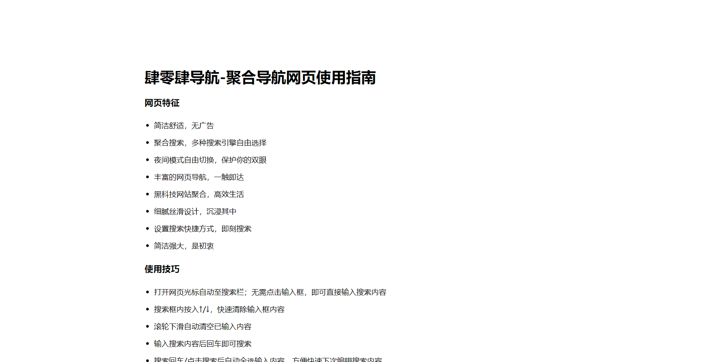

**效果图**

-   使用Typora创建页面

上述方法利用纯Html不方便添加其他样式，可以借助Typora软件，使用Markdown写作完成后，直接生成Html：

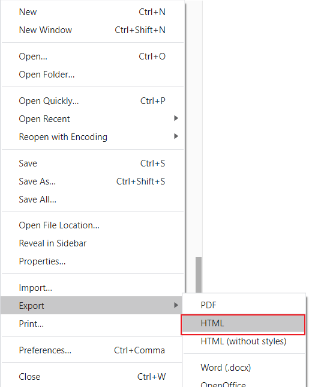

**Html export**

-   将生成好的Html使用文本编辑器打开，全选代码复制，粘贴到`aboutnav.ejs`中，并在代码最前面加入(不经过渲染)：

```
---
layout: false
---
```

```html
---
layout: false
---
<!doctype html>
<html>
<head>
<meta charset='UTF-8'><meta name='viewport' content='width=device-width initial-scale=1'>
<title>关于|肆零肆聚合导航网页使用指南</title><link href='https://fonts.loli.net/css?family=Open+Sans:400italic,700italic,700,400&subset=latin,latin-ext' rel='stylesheet' type='text/css' /><style type='text/css'>html {overflow-x: initial !important;}:root { --bg-color:#ffffff; --text-color:#333333; --select-text-bg-color:#B5D6FC; --select-text-font-color:auto; --monospace:"Lucida Console",Consolas,"Courier",monospace; }
html { font-size: 14px; background-color: var(--bg-color); color: var(--text-color); font-family: "Helvetica Neue", Helvetica, Arial, sans-serif; -webkit-font-smoothing: antialiased; }
body { margin: 0px; padding: 0px; height: auto; bottom: 0px; top: 0px; left: 0px; right: 0px; font-size: 1rem; line-height: 1.42857; overflow-x: hidden; background: inherit; tab-size: 4; }
iframe { margin: auto; }
a.url { word-break: break-all; }
a:active, a:hover { outline: 0px; }
.in-text-selection, ::selection { text-shadow: none; background: var(--select-text-bg-color); color: var(--select-text-font-color); }
#write { margin: 0px auto; height: auto; width: inherit; word-break: normal; overflow-wrap: break-word; position: relative; white-space: normal; overflow-x: visible; padding-top: 40px; }
#write.first-line-indent p { text-indent: 2em; }
#write.first-line-indent li p, #write.first-line-indent p * { text-indent: 0px; }
#write.first-line-indent li { margin-left: 2em; }
.for-image #write { padding-left: 8px; padding-right: 8px; }
body.typora-export { padding-left: 30px; padding-right: 30px; }
.typora-export .footnote-line, .typora-export li, .typora-export p { white-space: pre-wrap; }
.typora-export .task-list-item input { pointer-events: none; }
@media screen and (max-width: 500px) {
  body.typora-export { padding-left: 0px; padding-right: 0px; }
  #write { padding-left: 20px; padding-right: 20px; }
  .CodeMirror-sizer { margin-left: 0px !important; }
  .CodeMirror-gutters { display: none !important; }
}
#write li > figure:last-child { margin-bottom: 0.5rem; }
#write ol, #write ul { position: relative; }
img { max-width: 100%; vertical-align: middle; image-orientation: from-image; }
button, input, select, textarea { color: inherit; font: inherit; }
input[type="checkbox"], input[type="radio"] { line-height: normal; padding: 0px; }
*, ::after, ::before { box-sizing: border-box; }
#write h1, #write h2, #write h3, #write h4, #write h5, #write h6, #write p, #write pre { width: inherit; }
#write h1, #write h2, #write h3, #write h4, #write h5, #write h6, #write p { position: relative; }
p { line-height: inherit; }
h1, h2, h3, h4, h5, h6 { break-after: avoid-page; break-inside: avoid; orphans: 4; }
p { orphans: 4; }
h1 { font-size: 2rem; }
h2 { font-size: 1.8rem; }
h3 { font-size: 1.6rem; }
h4 { font-size: 1.4rem; }
h5 { font-size: 1.2rem; }
h6 { font-size: 1rem; }
.md-math-block, .md-rawblock, h1, h2, h3, h4, h5, h6, p { margin-top: 1rem; margin-bottom: 1rem; }
.hidden { display: none; }
.md-blockmeta { color: rgb(204, 204, 204); font-weight: 700; font-style: italic; }
a { cursor: pointer; }
sup.md-footnote { padding: 2px 4px; background-color: rgba(238, 238, 238, 0.7); color: rgb(85, 85, 85); border-radius: 4px; cursor: pointer; }
sup.md-footnote a, sup.md-footnote a:hover { color: inherit; text-transform: inherit; text-decoration: inherit; }
#write input[type="checkbox"] { cursor: pointer; width: inherit; height: inherit; }
figure { overflow-x: auto; margin: 1.2em 0px; max-width: calc(100% + 16px); padding: 0px; }
figure > table { margin: 0px; }
tr { break-inside: avoid; break-after: auto; }
thead { display: table-header-group; }
table { border-collapse: collapse; border-spacing: 0px; width: 100%; overflow: auto; break-inside: auto; text-align: left; }
table.md-table td { min-width: 32px; }
.CodeMirror-gutters { border-right: 0px; background-color: inherit; }
.CodeMirror-linenumber { user-select: none; }
.CodeMirror { text-align: left; }
.CodeMirror-placeholder { opacity: 0.3; }
.CodeMirror pre { padding: 0px 4px; }
.CodeMirror-lines { padding: 0px; }
div.hr:focus { cursor: none; }
#write pre { white-space: pre-wrap; }
#write.fences-no-line-wrapping pre { white-space: pre; }
#write pre.ty-contain-cm { white-space: normal; }
.CodeMirror-gutters { margin-right: 4px; }
.md-fences { font-size: 0.9rem; display: block; break-inside: avoid; text-align: left; overflow: visible; white-space: pre; background: inherit; position: relative !important; }
.md-diagram-panel { width: 100%; margin-top: 10px; text-align: center; padding-top: 0px; padding-bottom: 8px; overflow-x: auto; }
#write .md-fences.mock-cm { white-space: pre-wrap; }
.md-fences.md-fences-with-lineno { padding-left: 0px; }
#write.fences-no-line-wrapping .md-fences.mock-cm { white-space: pre; overflow-x: auto; }
.md-fences.mock-cm.md-fences-with-lineno { padding-left: 8px; }
.CodeMirror-line, twitterwidget { break-inside: avoid; }
.footnotes { opacity: 0.8; font-size: 0.9rem; margin-top: 1em; margin-bottom: 1em; }
.footnotes + .footnotes { margin-top: 0px; }
.md-reset { margin: 0px; padding: 0px; border: 0px; outline: 0px; vertical-align: top; background: 0px 0px; text-decoration: none; text-shadow: none; float: none; position: static; width: auto; height: auto; white-space: nowrap; cursor: inherit; -webkit-tap-highlight-color: transparent; line-height: normal; font-weight: 400; text-align: left; box-sizing: content-box; direction: ltr; }
li div { padding-top: 0px; }
blockquote { margin: 1rem 0px; }
li .mathjax-block, li p { margin: 0.5rem 0px; }
li { margin: 0px; position: relative; }
blockquote > :last-child { margin-bottom: 0px; }
blockquote > :first-child, li > :first-child { margin-top: 0px; }
.footnotes-area { color: rgb(136, 136, 136); margin-top: 0.714rem; padding-bottom: 0.143rem; white-space: normal; }
#write .footnote-line { white-space: pre-wrap; }
@media print {
  body, html { border: 1px solid transparent; height: 99%; break-after: avoid; break-before: avoid; font-variant-ligatures: no-common-ligatures; }
  #write { margin-top: 0px; padding-top: 0px; border-color: transparent !important; }
  .typora-export * { -webkit-print-color-adjust: exact; }
  html.blink-to-pdf { font-size: 13px; }
  .typora-export #write { break-after: avoid; }
  .typora-export #write::after { height: 0px; }
  .is-mac table { break-inside: avoid; }
}
.footnote-line { margin-top: 0.714em; font-size: 0.7em; }
a img, img a { cursor: pointer; }
pre.md-meta-block { font-size: 0.8rem; min-height: 0.8rem; white-space: pre-wrap; background: rgb(204, 204, 204); display: block; overflow-x: hidden; }
p > .md-image:only-child:not(.md-img-error) img, p > img:only-child { display: block; margin: auto; }
#write.first-line-indent p > .md-image:only-child:not(.md-img-error) img { left: -2em; position: relative; }
p > .md-image:only-child { display: inline-block; width: 100%; }
#write .MathJax_Display { margin: 0.8em 0px 0px; }
.md-math-block { width: 100%; }
.md-math-block:not(:empty)::after { display: none; }
[contenteditable="true"]:active, [contenteditable="true"]:focus, [contenteditable="false"]:active, [contenteditable="false"]:focus { outline: 0px; box-shadow: none; }
.md-task-list-item { position: relative; list-style-type: none; }
.task-list-item.md-task-list-item { padding-left: 0px; }
.md-task-list-item > input { position: absolute; top: 0px; left: 0px; margin-left: -1.2em; margin-top: calc(1em - 10px); border: none; }
.math { font-size: 1rem; }
.md-toc { min-height: 3.58rem; position: relative; font-size: 0.9rem; border-radius: 10px; }
.md-toc-content { position: relative; margin-left: 0px; }
.md-toc-content::after, .md-toc::after { display: none; }
.md-toc-item { display: block; color: rgb(65, 131, 196); }
.md-toc-item a { text-decoration: none; }
.md-toc-inner:hover { text-decoration: underline; }
.md-toc-inner { display: inline-block; cursor: pointer; }
.md-toc-h1 .md-toc-inner { margin-left: 0px; font-weight: 700; }
.md-toc-h2 .md-toc-inner { margin-left: 2em; }
.md-toc-h3 .md-toc-inner { margin-left: 4em; }
.md-toc-h4 .md-toc-inner { margin-left: 6em; }
.md-toc-h5 .md-toc-inner { margin-left: 8em; }
.md-toc-h6 .md-toc-inner { margin-left: 10em; }
@media screen and (max-width: 48em) {
  .md-toc-h3 .md-toc-inner { margin-left: 3.5em; }
  .md-toc-h4 .md-toc-inner { margin-left: 5em; }
  .md-toc-h5 .md-toc-inner { margin-left: 6.5em; }
  .md-toc-h6 .md-toc-inner { margin-left: 8em; }
}
a.md-toc-inner { font-size: inherit; font-style: inherit; font-weight: inherit; line-height: inherit; }
.footnote-line a:not(.reversefootnote) { color: inherit; }
.md-attr { display: none; }
.md-fn-count::after { content: "."; }
code, pre, samp, tt { font-family: var(--monospace); }
kbd { margin: 0px 0.1em; padding: 0.1em 0.6em; font-size: 0.8em; color: rgb(36, 39, 41); background: rgb(255, 255, 255); border: 1px solid rgb(173, 179, 185); border-radius: 3px; box-shadow: rgba(12, 13, 14, 0.2) 0px 1px 0px, rgb(255, 255, 255) 0px 0px 0px 2px inset; white-space: nowrap; vertical-align: middle; }
.md-comment { color: rgb(162, 127, 3); opacity: 0.8; font-family: var(--monospace); }
code { text-align: left; vertical-align: initial; }
a.md-print-anchor { white-space: pre !important; border-width: initial !important; border-style: none !important; border-color: initial !important; display: inline-block !important; position: absolute !important; width: 1px !important; right: 0px !important; outline: 0px !important; background: 0px 0px !important; text-decoration: initial !important; text-shadow: initial !important; }
.md-inline-math .MathJax_SVG .noError { display: none !important; }
.html-for-mac .inline-math-svg .MathJax_SVG { vertical-align: 0.2px; }
.md-math-block .MathJax_SVG_Display { text-align: center; margin: 0px; position: relative; text-indent: 0px; max-width: none; max-height: none; min-height: 0px; min-width: 100%; width: auto; overflow-y: hidden; display: block !important; }
.MathJax_SVG_Display, .md-inline-math .MathJax_SVG_Display { width: auto; margin: inherit; display: inline-block !important; }
.MathJax_SVG .MJX-monospace { font-family: var(--monospace); }
.MathJax_SVG .MJX-sans-serif { font-family: sans-serif; }
.MathJax_SVG { display: inline; font-style: normal; font-weight: 400; line-height: normal; zoom: 90%; text-indent: 0px; text-align: left; text-transform: none; letter-spacing: normal; word-spacing: normal; overflow-wrap: normal; white-space: nowrap; float: none; direction: ltr; max-width: none; max-height: none; min-width: 0px; min-height: 0px; border: 0px; padding: 0px; margin: 0px; }
.MathJax_SVG * { transition: none 0s ease 0s; }
.MathJax_SVG_Display svg { vertical-align: middle !important; margin-bottom: 0px !important; margin-top: 0px !important; }
.os-windows.monocolor-emoji .md-emoji { font-family: "Segoe UI Symbol", sans-serif; }
.md-diagram-panel > svg { max-width: 100%; }
[lang="flow"] svg, [lang="mermaid"] svg { max-width: 100%; height: auto; }
[lang="mermaid"] .node text { font-size: 1rem; }
table tr th { border-bottom: 0px; }
video { max-width: 100%; display: block; margin: 0px auto; }
iframe { max-width: 100%; width: 100%; border: none; }
.highlight td, .highlight tr { border: 0px; }
svg[id^="mermaidChart"] { line-height: 1em; }
mark { background: rgb(255, 255, 0); color: rgb(0, 0, 0); }
.md-html-inline .md-plain, .md-html-inline strong, mark .md-inline-math, mark strong { color: inherit; }
mark .md-meta { color: rgb(0, 0, 0); opacity: 0.3 !important; }
@media print {
  .typora-export h1, .typora-export h2, .typora-export h3, .typora-export h4, .typora-export h5, .typora-export h6 { break-inside: avoid; }
  .typora-export h1::after, .typora-export h2::after, .typora-export h3::after, .typora-export h4::after, .typora-export h5::after, .typora-export h6::after { content: ""; display: block; height: 100px; margin-bottom: -100px; }
}


:root {
    --side-bar-bg-color: #fafafa;
    --control-text-color: #777;
}

@include-when-export url(https://fonts.loli.net/css?family=Open+Sans:400italic,700italic,700,400&subset=latin,latin-ext);

  html {
    font-size: 16px;
}

body {
    font-family: "Open Sans","Clear Sans", "Helvetica Neue", Helvetica, Arial, sans-serif;
    color: rgb(51, 51, 51);
    line-height: 1.6;
}

#write {
    max-width: 860px;
      margin: 0 auto;
      padding: 30px;
}

@media only screen and (min-width: 1400px) {
    #write {
        max-width: 1024px;
    }
}

@media only screen and (min-width: 1800px) {
    #write {
        max-width: 1200px;
    }
}

#write > ul:first-child,
#write > ol:first-child{
    margin-top: 30px;
}

a {
    color: #4183C4;
}
h1,
h2,
h3,
h4,
h5,
h6 {
    position: relative;
    margin-top: 1rem;
    margin-bottom: 1rem;
    font-weight: bold;
    line-height: 1.4;
    cursor: text;
}
h1:hover a.anchor,
h2:hover a.anchor,
h3:hover a.anchor,
h4:hover a.anchor,
h5:hover a.anchor,
h6:hover a.anchor {
    text-decoration: none;
}
h1 tt,
h1 code {
    font-size: inherit;
}
h2 tt,
h2 code {
    font-size: inherit;
}
h3 tt,
h3 code {
    font-size: inherit;
}
h4 tt,
h4 code {
    font-size: inherit;
}
h5 tt,
h5 code {
    font-size: inherit;
}
h6 tt,
h6 code {
    font-size: inherit;
}
h1 {
    font-size: 2.25em;
    line-height: 1.2;
    border-bottom: 1px solid #eee;
}
h2 {
    font-size: 1.75em;
    line-height: 1.225;
    border-bottom: 1px solid #eee;
}

@media print {
    .typora-export h1,
    .typora-export h2 {
        border-bottom: none;
        padding-bottom: initial;
    }

    .typora-export h1::after,
    .typora-export h2::after {
        border-top: 1px solid #eee;
        margin-top: .3em;
    }
}

h3 {
    font-size: 1.5em;
    line-height: 1.43;
}
h4 {
    font-size: 1.25em;
}
h5 {
    font-size: 1em;
}
h6 {
   font-size: 1em;
    color: #777;
}
p,
blockquote,
ul,
ol,
dl,
table{
    margin: 0.8em 0;
}
li>ol,
li>ul {
    margin: 0 0;
}
hr {
    height: 2px;
    padding: 0;
    margin: 16px 0;
    background-color: #e7e7e7;
    border: 0 none;
    overflow: hidden;
    box-sizing: content-box;
}

li p.first {
    display: inline-block;
}
ul,
ol {
    padding-left: 30px;
}
ul:first-child,
ol:first-child {
    margin-top: 0;
}
ul:last-child,
ol:last-child {
    margin-bottom: 0;
}
blockquote {
    border-left: 4px solid #dfe2e5;
    padding: 0 15px;
    color: #777777;
}
blockquote blockquote {
    padding-right: 0;
}
table {
    padding: 0;
    word-break: initial;
}
table tr {
    border-top: 1px solid #dfe2e5;
    margin: 0;
    padding: 0;
}
table tr:nth-child(2n),
thead {
    background-color: #f8f8f8;
}
table tr th {
    font-weight: bold;
    border: 1px solid #dfe2e5;
    border-bottom: 0;
    margin: 0;
    padding: 6px 13px;
}
table tr td {
    border: 1px solid #dfe2e5;
    margin: 0;
    padding: 6px 13px;
}
table tr th:first-child,
table tr td:first-child {
    margin-top: 0;
}
table tr th:last-child,
table tr td:last-child {
    margin-bottom: 0;
}

.CodeMirror-lines {
    padding-left: 4px;
}

.code-tooltip {
    box-shadow: 0 1px 1px 0 rgba(0,28,36,.3);
    border-top: 1px solid #eef2f2;
}

.md-fences,
code,
tt {
    border: 1px solid #e7eaed;
    background-color: #f8f8f8;
    border-radius: 3px;
    padding: 0;
    padding: 2px 4px 0px 4px;
    font-size: 0.9em;
}

code {
    background-color: #f3f4f4;
    padding: 0 2px 0 2px;
}

.md-fences {
    margin-bottom: 15px;
    margin-top: 15px;
    padding-top: 8px;
    padding-bottom: 6px;
}


.md-task-list-item > input {
  margin-left: -1.3em;
}

@media print {
    html {
        font-size: 13px;
    }
    table,
    pre {
        page-break-inside: avoid;
    }
    pre {
        word-wrap: break-word;
    }
}

.md-fences {
    background-color: #f8f8f8;
}
#write pre.md-meta-block {
    padding: 1rem;
    font-size: 85%;
    line-height: 1.45;
    background-color: #f7f7f7;
    border: 0;
    border-radius: 3px;
    color: #777777;
    margin-top: 0 !important;
}

.mathjax-block>.code-tooltip {
    bottom: .375rem;
}

.md-mathjax-midline {
    background: #fafafa;
}

#write>h3.md-focus:before{
    left: -1.5625rem;
    top: .375rem;
}
#write>h4.md-focus:before{
    left: -1.5625rem;
    top: .285714286rem;
}
#write>h5.md-focus:before{
    left: -1.5625rem;
    top: .285714286rem;
}
#write>h6.md-focus:before{
    left: -1.5625rem;
    top: .285714286rem;
}
.md-image>.md-meta {
    /*border: 1px solid #ddd;*/
    border-radius: 3px;
    padding: 2px 0px 0px 4px;
    font-size: 0.9em;
    color: inherit;
}

.md-tag {
    color: #a7a7a7;
    opacity: 1;
}

.md-toc { 
    margin-top:20px;
    padding-bottom:20px;
}

.sidebar-tabs {
    border-bottom: none;
}

#typora-quick-open {
    border: 1px solid #ddd;
    background-color: #f8f8f8;
}

#typora-quick-open-item {
    background-color: #FAFAFA;
    border-color: #FEFEFE #e5e5e5 #e5e5e5 #eee;
    border-style: solid;
    border-width: 1px;
}

/** focus mode */
.on-focus-mode blockquote {
    border-left-color: rgba(85, 85, 85, 0.12);
}

header, .context-menu, .megamenu-content, footer{
    font-family: "Segoe UI", "Arial", sans-serif;
}

.file-node-content:hover .file-node-icon,
.file-node-content:hover .file-node-open-state{
    visibility: visible;
}

.mac-seamless-mode #typora-sidebar {
    background-color: #fafafa;
    background-color: var(--side-bar-bg-color);
}

.md-lang {
    color: #b4654d;
}

.html-for-mac .context-menu {
    --item-hover-bg-color: #E6F0FE;
}

#md-notification .btn {
    border: 0;
}

.dropdown-menu .divider {
    border-color: #e5e5e5;
}

.ty-preferences .window-content {
    background-color: #fafafa;
}

.ty-preferences .nav-group-item.active {
    color: white;
    background: #999;
}


</style>
</head>
<body class='typora-export os-windows'>
<div id='write'  class=''><p>&nbsp;</p><p>&nbsp;</p><h2><a name="肆零肆导航-聚合导航网页使用指南" class="md-header-anchor"></a><span>肆零肆导航-聚合导航网页使用指南</span></h2><p>&nbsp;</p><p></p><p>&nbsp;</p><h3><a name="网页特征" class="md-header-anchor"></a><span>网页特征</span></h3><ul><li><span>简洁舒适，无广告</span></li></ul><ul><li><span>聚合搜索，多种搜索引擎自由选择</span></li></ul><ul><li><span>夜间模式自由切换，保护你的双眼</span></li></ul><ul><li><span>丰富的网页导航，一触即达</span></li></ul><ul><li><span>黑科技网站聚合，高效生活</span></li><li><span>细腻丝滑设计，沉浸其中</span></li><li><span>设置搜索快捷方式，即刻搜索</span></li><li><span>简洁强大，是初衷</span></li></ul><p>&nbsp;</p><h3><a name="使用技巧" class="md-header-anchor"></a><span>使用技巧</span></h3><ul><li><span>打开网页光标自动锁定搜索栏；无需点击输入框，即可直接输入搜索内容</span></li></ul><ul><li><kbd><span>Enter</span></kbd><span>/</span><kbd><span>Tab</span></kbd><span>键自动定位光标到输入框，无需鼠标点击</span></li></ul><p></p><ul><li><span>输入搜索内容后</span><kbd><span>Enter</span></kbd><span>即可搜索</span></li></ul><ul><li><kbd><span>Enter</span></kbd><span>/点击🖱搜索后自动全选输入内容，方便快速下次编辑搜索内容</span></li></ul><ul><li><span>搜索框内按入</span><kbd><span>↑</span></kbd><span>/</span><kbd><span>↓</span></kbd><span>，快速清除输入框内容</span></li></ul><p></p><ul><li><span>滚轮下滑自动清空已输入内容</span></li></ul><p></p><ul><li><span>点击</span><code>回到顶部</code><span>按钮，无需点击输入框即可直接搜索</span></li></ul><p>&nbsp;</p><h3><a name="其他说明" class="md-header-anchor"></a><span>其他说明</span></h3><ul><li><p><span>建议</span><kbd><span>Ctrl</span></kbd><span> +</span><kbd><span>D</span></kbd><span>收藏网站</span></p></li><li><p><span>为了尽可能保证良好的使用体验，请使用谷歌浏览器，谷歌浏览器下载地址:</span><a href='https://sumsung.lanzous.com/i87Jufckfif'><span>谷歌浏览器</span></a></p></li><li><p><span>设置默认启动页（主页）：</span></p><p><span>    </span><span>打开谷歌浏览器-设置-启动时-添加新网页-输入框输入：</span><a href='https://xmq.plus/nav'><span>https://xmq.plus/nav</span></a><span>-保存确定</span></p></li></ul><p>&nbsp;</p><h3><a name="效果展示" class="md-header-anchor"></a><span>效果展示</span></h3><p></p><p></p><p></p><p>&nbsp;</p><p>&nbsp;</p><p><a href='https://xmq.plus/nav'><span>←回到首页</span></a></p><p>&nbsp;</p><p>&nbsp;</p><p><span>copyright © 2020 xmq.plus All rights reserved.  湘ICP备2020018001号</span></p></div>
</body>
</html>
```

-   Typora生成效果

[导航-关于页面](https://xmq.plus/aboutnav)

### [](https://xmq.plus/posts/2547c616.html#4-%E5%BB%BA%E7%AB%8B%E8%BD%AF%E4%BB%B6%E6%B8%85%E5%8D%95%E9%A1%B5%E9%9D%A2 "4.建立软件清单页面")4.建立软件清单页面

创建新页面`hexo new page mac`，更改新建`index.md`文件：

复制成功

```
---
title: Mac软件
date: 2020-08-27 22:31:51
type: "mac"
layout: "mac"
---
```

在`themes/layout/`下新建文件`mac.ejs`:

```js
<%- partial('_partial/bg-cover') %>
<style>
    .friends-container {
        margin-top: -100px;
        margin-bottom: 30px;
    }

    .friends-container .tag-title {
        margin-bottom: 10px;
        color: #3C4858;
        font-size: 1.75rem;
        font-weight: 400;
    }

    .frind-ship img {
        border-radius: 10%;
    }

    /* 以下是按钮样式 */

    .frind-ship {
        padding: 10px 20px;
    }

    .frind-ship .title {
        display: flex;
        align-items: center;
    }

    .frind-ship .title div {
        color: #fff;
        padding-left: 10px;
    }

    .frind-ship .title img {
        width: 100px;
        height: 100px;
        flex-shrink: 0;
    }

    .frind-ship .title h1 {
        padding-bottom: 5px;
        border-bottom: 2px solid #fff;
        position: relative;
        top:-15px;
        left: 3px;
    }

    .friend-button {
        display: flex;
        justify-content: center;
        margin-bottom: -27px;
    }

    .friend-button a {
        border-radius: 40px;
    }

    .friend-all .tag-post {
        margin-bottom: 30px;
    }

    .button-caution {
        background-color: #FF4351;
        border-color: #FF4351;
        color: #FFF;
    }

    .button {
        font-weight: 300;
        font-size: 16px;
        font-family: "Helvetica Neue Light", "Helvetica Neue", Helvetica, Arial, "Lucida Grande", sans-serif;
        text-decoration: none;
        text-align: center;
        line-height: 40px;
        height: 40px;
        padding: 0 40px;
        margin: 0;
        display: inline-block;
        appearance: none;
        cursor: pointer;
        border: none;
        -webkit-box-sizing: border-box;
        -moz-box-sizing: border-box;
        box-sizing: border-box;
        -webkit-transition-property: all;
        transition-property: all;
        -webkit-transition-duration: .3s;
        transition-duration: .3s;
    }

    .title {
        margin-bottom: 0rem !important;
    }

    .card {
        margin: 3rem 0 1rem 0 !important;
    }

    .button-glow.button-caution {
        -webkit-animation-name: glowing-caution;
        animation-name: glowing-caution;
    }

    @-webkit-keyframes glowing-caution {
        from {
            -webkit-box-shadow: 0 0 0 rgba(255, 67, 81, 0.3);
            box-shadow: 0 0 0 rgba(255, 67, 81, 0.3);
        }

        50% {
            -webkit-box-shadow: 0 0 20px rgba(255, 67, 81, 0.8);
            box-shadow: 0 0 20px rgba(255, 67, 81, 0.8);
        }

        to {
            -webkit-box-shadow: 0 0 0 rgba(255, 67, 81, 0.3);
            box-shadow: 0 0 0 rgba(255, 67, 81, 0.3);
        }
    }

    @keyframes glowing-caution {
        from {
            -webkit-box-shadow: 0 0 0 rgba(255, 67, 81, 0.3);
            box-shadow: 0 0 0 rgba(255, 67, 81, 0.3);
        }

        50% {
            -webkit-box-shadow: 0 0 20px rgba(255, 67, 81, 0.8);
            box-shadow: 0 0 20px rgba(255, 67, 81, 0.8);
        }

        to {
            -webkit-box-shadow: 0 0 0 rgba(255, 67, 81, 0.3);
            box-shadow: 0 0 0 rgba(255, 67, 81, 0.3);
        }
    }

    .button-caution:hover {
        background-color: #ff7680;
        border-color: #ff7680;
        color: #FFF;
        text-decoration: none;
    }

    .frind-card1 {
        background-image: linear-gradient(to right, #4facfe 0%, #00f2fe 100%);
    }

    .frind-card2 {
        background-image: linear-gradient(135deg, #667eea 0%, #764ba2 100%);
    }

    .frind-card3 {
        background-image: linear-gradient(to right, #b8cbb8 0%, #b8cbb8 0%, #b465da 0%, #cf6cc9 33%, #ee609c 66%, #ee609c 100%);
    }

    .frind-card4 {
        background-image: linear-gradient(to right, #6a11cb 0%, #2575fc 100%);
    }

    .frind-card5 {
        background-image: linear-gradient(to top, #c471f5 0%, #fa71cd 100%);
    }

    .frind-card6 {
        background-image: linear-gradient(to top, #48c6ef 0%, #6f86d6 100%);
    }

    .frind-card7 {
        background-image: linear-gradient(to top, #0ba360 0%, #3cba92 100%);
    }

    .frind-card8 {
        background-image: linear-gradient(to top, #0c3483 0%, #a2b6df 100%, #6b8cce 100%, #a2b6df 100%);
    }

    .frind-card9 {
        background-image: linear-gradient(to right, #ff758c 0%, #ff7eb3 100%);
    }

    .frind-card10 {
        background-image: linear-gradient(to top, #f77062 0%, #fe5196 100%);
    }

    article .card {
        overflow: visible !important;
    }
</style>

<main class="content">
    <div class="container friends-container">
        <div class="card">
            <div class="card-content">
                <div class="tag-title center-align">
                    <i class="fab fa-windows"></i>&nbsp;&nbsp;Mac软件清单
                </div>
                <article id="friends-link">
                    <% if (site.data && site.data.mac) { %>
                    <% var friends = site.data.mac; %>
                    <div class="row tags-posts friend-all">
                        <% for (var i = 0, len = friends.length; i < len; i++) { %>
                        <% var friend = friends[i]; %>
                        <div class="col s12 m6 l4 friend-div" data-aos="zoom-in-up">
                            <div class="card frind-card<%- ((i % 10) +1) %>">
                                <div class="frind-ship">
                                    <div class="title">
                                        " alt="img">
                                        <div>
                                            <h1 class="friend-name"><%= friend.name %></h1>
                                            <p style="position: relative;top: -35px;"><%= friend.introduction %></p>
                                        </div>
                                    </div>
                                    <div class="friend-button">
                                        <a href="<%- url_for(friend.url) %>" target="_blank"
                                            class="button button-glow button-rounded button-caution">
                                            <%= friend.title %>
                                        </a>
                                    </div>
                                </div>
                            </div>
                        </div>
                        <% } %>
                    </div>
                    <% } %>
                </article>
            </div>
        </div>
        <div class="card">
            <div class="card-content">
                <p style="text-align: center;">软件密码：1234</p>
            </div>
        </div>
    </div>
</main>

<script>
    $(function () {
        $('#friends-link').masonry({
            itemSelector: '.friend-div'
        });
    });
</script>
```

> 如需单独设置封面可将顶栏`<%- partial('_partial/bg-cover') %>`替换为相应ejs中的内容，相应修改即可。

### [](https://xmq.plus/posts/2547c616.html#5-%E6%96%87%E7%AB%A0%E7%94%9F%E6%88%90%E6%B0%B8%E4%B9%85%E9%93%BE%E6%8E%A5 "5.文章生成永久链接")5.文章生成永久链接

主题默认的文章链接配置是：

```yml
permalink: :year/:month/:day/:title
```

这种生成的链接地址很长，文章版权的链接地址会出现一大串字符编码，一点也不好看。因此需要修改文章生成链接的格式。

首先再根目录下执行下面的命令：

[hexo-abbrlinkGitHub 地址](https://github.com/rozbo/hexo-abbrlink)

```yml
npm install hexo-abbrlink --save
```

然后站点配置文件下添加如下配置：

```yml
abbrlink:
    alg: crc16   #算法： crc16(default) and crc32
    rep: hex     #进制： dec(default) and hex: dec #输出进制：十进制和十六进制，默认为10进制。丨dec为十进制，hex为十六进制
```

再将站点配置文件的 permalink 的值修改为：

```yml
permalink: posts/:abbrlink.html  # 此处可以自己设置，也可以直接使用 /:abbrlink
```

生成文章的链接格式就会是如下样例（官方样例）:

```yml
crc16 & hex
https://post.zz173.com/posts/66c8.html

crc16 & dec
https://post.zz173.com/posts/65535.html
crc32 & hex
https://post.zz173.com/posts/8ddf18fb.html

crc32 & dec
https://post.zz173.com/posts/1690090958.html
```

生成完后，原 md 文件的 Front-matter 内会增加 abbrlink 字段，值为生成的 ID 。这个字段确保了在我们修改了 Front-matter 内的博客标题 title 或创建日期 date 字段之后而不会改变链接地址。

### [](https://xmq.plus/posts/2547c616.html#6-%E2%80%9C%E5%85%B3%E4%BA%8E%E2%80%9D%E9%A1%B5%E9%9D%A2%E5%A2%9E%E5%8A%A0%E7%AE%80%E5%8E%86 "6.“关于”页面增加简历")6.“关于”页面增加简历

修改`/themes/matery/layout/about.ejs`，找到`<div class="card">`标签，然后找到它对应的`</div>`标签，接在后面新增一个`card`，语句如下：

```html
<div class="card">
    <div class="card-content">
        <div class="card-content article-card-content">
                <div class="title center-align" data-aos="zoom-in-up">
                    <i class="fa fa-address-book"></i>&nbsp;&nbsp;<%- __('myCV') %>
                </div>
                <div id="articleContent" data-aos="fade-up">
                    <%- page.content %>
                </div>
        </div>
    </div>
</div>
```

这样就会多出一张`card`，然后可以在`/source/about/index.md`下面写上你的简历了，当然这里的位置随你自己设置，你也可以把简历作为第一个`card`。

### [](https://xmq.plus/posts/2547c616.html#7-%E5%8E%8B%E7%BC%A9%E4%BB%A3%E7%A0%81 "7.压缩代码")7.压缩代码

因为 hexo 生成的 html、css、js 等都有很多的空格或者换行，而空格和换行也是占用字节的，所以需要将空格换行去掉也就是我要进行的 “压缩”。

有人说空格换行能占多少字节？确实占不了多少，但是一个人访问是这么多字节，那么一百人，一万人呢？加起来这量就不少了吧，这都是流量啊！这也是很多 css/js 文件的后缀为.min.js 或.min.css 的原因。虽然我们可能没那么多访问量，但是能减小一点资源文件的大小也是对访问速度有那么一点提升的。

我们采用 gulp 代码压缩方式。

使用方法：

进入站点根目录下依次执行下面的命令：

```bash
# 全局安装gulp模块
npm install gulp -g
# 安装各种小功能模块  执行这步的时候，可能会提示权限的问题，最好以管理员模式执行
npm install gulp gulp-htmlclean gulp-htmlmin gulp-minify-css gulp-uglify gulp-imagemin --save
# 额外的功能模块
npm install gulp-debug gulp-clean-css gulp-changed gulp-if gulp-plumber gulp-babel babel-preset-es2015 del @babel/core --save
```

在 Hexo 根目录新建文件 gulpfile.js，并复制以下内容到文件中，有中文注释，可以根据自己需求修改。（注意：文件名不能错，一定为 gulpfile.js，否则会出错！）

```js
var gulp = require("gulp");
var debug = require("gulp-debug");
var cleancss = require("gulp-clean-css"); //css压缩组件
var uglify = require("gulp-uglify"); //js压缩组件
var htmlmin = require("gulp-htmlmin"); //html压缩组件
var htmlclean = require("gulp-htmlclean"); //html清理组件
var imagemin = require("gulp-imagemin"); //图片压缩组件
var changed = require("gulp-changed"); //文件更改校验组件
var gulpif = require("gulp-if"); //任务 帮助调用组件
var plumber = require("gulp-plumber"); //容错组件（发生错误不跳出任务，并报出错误内容）
var isScriptAll = true; //是否处理所有文件，(true|处理所有文件)(false|只处理有更改的文件)
var isDebug = true; //是否调试显示 编译通过的文件
var gulpBabel = require("gulp-babel");
var es2015Preset = require("babel-preset-es2015");
var del = require("del");
var Hexo = require("hexo");
var hexo = new Hexo(process.cwd(), {}); // 初始化一个hexo对象

// 清除public文件夹
gulp.task("clean", function () {
    return del(["public/**/*"]);
});

// 下面几个跟hexo有关的操作，主要通过hexo.call()去执行，注意return
// 创建静态页面 （等同 hexo generate）
gulp.task("generate", function () {
    return hexo.init().then(function () {
        return hexo
            .call("generate", {
                watch: false
            })
            .then(function () {
                return hexo.exit();
            })
            .catch(function (err) {
                return hexo.exit(err);
            });
    });
});

// 启动Hexo服务器
gulp.task("server", function () {
    return hexo
        .init()
        .then(function () {
            return hexo.call("server", {});
        })
        .catch(function (err) {
            console.log(err);
        });
});

// 部署到服务器
gulp.task("deploy", function () {
    return hexo.init().then(function () {
        return hexo
            .call("deploy", {
                watch: false
            })
            .then(function () {
                return hexo.exit();
            })
            .catch(function (err) {
                return hexo.exit(err);
            });
    });
});

// 压缩public目录下的js文件
gulp.task("compressJs", function () {
    return gulp
        .src(["./public/**/*.js", "!./public/libs/**"]) //排除的js
        .pipe(gulpif(!isScriptAll, changed("./public")))
        .pipe(gulpif(isDebug, debug({ title: "Compress JS:" })))
        .pipe(plumber())
        .pipe(
            gulpBabel({
                presets: [es2015Preset] // es5检查机制
            })
        )
        .pipe(uglify()) //调用压缩组件方法uglify(),对合并的文件进行压缩
        .pipe(gulp.dest("./public")); //输出到目标目录
});

// 压缩public目录下的css文件
gulp.task("compressCss", function () {
    var option = {
        rebase: false,
        //advanced: true, //类型：Boolean 默认：true [是否开启高级优化（合并选择器等）]
        compatibility: "ie7" //保留ie7及以下兼容写法 类型：String 默认：''or'*' [启用兼容模式； 'ie7'：IE7兼容模式，'ie8'：IE8兼容模式，'*'：IE9+兼容模式]
        //keepBreaks: true, //类型：Boolean 默认：false [是否保留换行]
        //keepSpecialComments: '*' //保留所有特殊前缀 当你用autoprefixer生成的浏览器前缀，如果不加这个参数，有可能将会删除你的部分前缀
    };
    return gulp
        .src(["./public/**/*.css", "!./public/**/*.min.css"]) //排除的css
        .pipe(gulpif(!isScriptAll, changed("./public")))
        .pipe(gulpif(isDebug, debug({ title: "Compress CSS:" })))
        .pipe(plumber())
        .pipe(cleancss(option))
        .pipe(gulp.dest("./public"));
});

// 压缩public目录下的html文件
gulp.task("compressHtml", function () {
    var cleanOptions = {
        protect: /<\!--%fooTemplate\b.*?%-->/g, //忽略处理
        unprotect: /<script [^>]*\btype="text\/x-handlebars-template"[\s\S]+?<\/script>/gi //特殊处理
    };
    var minOption = {
        collapseWhitespace: true, //压缩HTML
        collapseBooleanAttributes: true, //省略布尔属性的值 <input checked="true"/> ==> <input />
        removeEmptyAttributes: true, //删除所有空格作属性值 <input id="" /> ==> <input />
        removeScriptTypeAttributes: true, //删除<script>的type="text/javascript"
        removeStyleLinkTypeAttributes: true, //删除<style>和<link>的type="text/css"
        removeComments: true, //清除HTML注释
        minifyJS: true, //压缩页面JS
        minifyCSS: true, //压缩页面CSS
        minifyURLs: true //替换页面URL
    };
    return gulp
        .src("./public/**/*.html")
        .pipe(gulpif(isDebug, debug({ title: "Compress HTML:" })))
        .pipe(plumber())
        .pipe(htmlclean(cleanOptions))
        .pipe(htmlmin(minOption))
        .pipe(gulp.dest("./public"));
});

// 压缩 public/medias 目录内图片
gulp.task("compressImage", function () {
    var option = {
        optimizationLevel: 5, //类型：Number 默认：3 取值范围：0-7（优化等级）
        progressive: true, //类型：Boolean 默认：false 无损压缩jpg图片
        interlaced: false, //类型：Boolean 默认：false 隔行扫描gif进行渲染
        multipass: false //类型：Boolean 默认：false 多次优化svg直到完全优化
    };
    return gulp
        .src("./public/medias/**/*.*")
        .pipe(gulpif(!isScriptAll, changed("./public/medias")))
        .pipe(gulpif(isDebug, debug({ title: "Compress Images:" })))
        .pipe(plumber())
        .pipe(imagemin(option))
        .pipe(gulp.dest("./public"));
});
// 执行顺序： 清除public目录 -> 产生原始博客内容 -> 执行压缩混淆 -> 部署到服务器
gulp.task(
    "build",
    gulp.series(
        "clean",
        "generate",
        "compressHtml",
        "compressCss",
        "compressJs",
        "compressImage",
        gulp.parallel("deploy")
    )
);

// 默认任务
gulp.task(
    "default",
    gulp.series(
        "clean",
        "generate",
        gulp.parallel("compressHtml", "compressCss", "compressJs","compressImage")
    )
);
//Gulp4最大的一个改变就是gulp.task函数现在只支持两个参数，分别是任务名和运行任务的函数
```

以后的执行方式有两种：

-   直接在 Hexo 根目录执行 gulp 或者 gulp default ，这个命令相当于 hexo cl&&hexo g 并且再把代码和图片压缩。
-   在 Hexo 根目录执行 gulp build ，这个命令与第 1 种相比是：在最后又加了个 hexo d ，等于说生成、压缩文件后又帮你自动部署了。

> 值得注意的是：这个加入了图片压缩，如果不想用图片压缩可以把第 154 行的 “compressImage”, 和第 165 行的 ,”compressImage” 去掉即可

## [](https://xmq.plus/posts/2547c616.html#%E4%B8%83%E3%80%81%E5%B8%B8%E8%A7%81%E9%97%AE%E9%A2%98 "七、常见问题")七、常见问题

### [](https://xmq.plus/posts/2547c616.html#1-%E6%96%87%E7%AB%A0%E4%BB%A3%E7%A0%81%E5%9D%97%E4%B9%B1%E7%A0%81 "1.文章代码块乱码")1.文章代码块乱码

**问题描述：** 一是代码块中的 `{ }` 被转义，二是代码块中的代码可能会被渲染，甚至会影响整个文章页面的布局

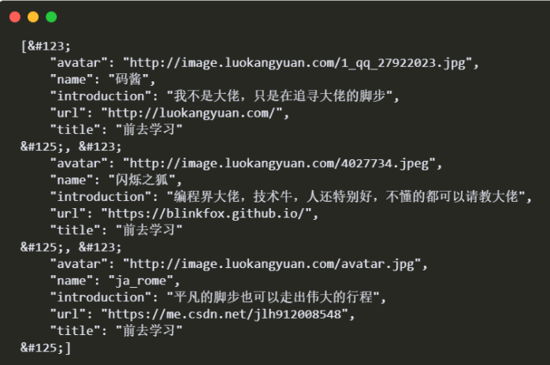

**代码显示异常**

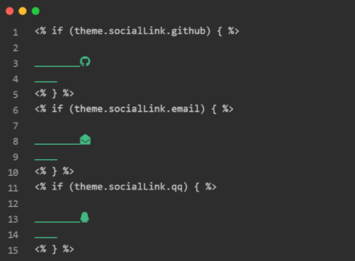

**代码显示异常**

**解决办法：**卸载现有新版本，更换[hexo@4.2.1](mailto:hexo@4.2.1)版本

**具体步骤：**

-   将版本降为低版本
    
    先卸载现有版本 npm uninstall hexo-cli -g
    
-   然后重新安装`npm hexo@4.2.1`
    
    ```bash
    npm install hexo@4.2.1
    
    npm install hexo-cli -g
    ```
    
-   重新创建一个文件夹`matery`，重新`hexo init matery`
    
-   将所有文件跳过式移动到新文件夹中(千万不要点替换文件)
    
-   然后再将自己的根目录下的`_config.yml`替换到新文件夹下根目录位置
    
-   删除自带主题`landscape`
    
-   以后不要安装`Prism_plugin`插件，否则会出现同样的问题
    
-   卸载插件命令：`npm un -S hexo-prism-plugin`
    

### [](https://xmq.plus/posts/2547c616.html#2-%E5%8D%B8%E8%BD%BD%E4%BB%A3%E7%A0%81%E9%AB%98%E4%BA%AE%E6%8F%92%E4%BB%B6%E5%90%8E%E4%BB%A3%E7%A0%81%E6%97%A0%E6%B3%95%E9%AB%98%E4%BA%AE "2.卸载代码高亮插件后代码无法高亮")2.卸载代码高亮插件后代码无法高亮

**问题描述：**卸载代码高亮插件Prism_plugin后代码无法高亮

**解决办法：**Prism_plugin插件在metary主题中无法正常使用，就换一种方式。

**具体办法：**

-   1.进入prismjs官网：[https://prismjs.com/download.html](https://prismjs.com/download.html)
    
-   2.选择主题、语言、其他插件
    

选择 theme 主题、language 支持的语言（不要选太多，够用就好）、plugin 插件（可以选Line Numbers、Copy to Clipboard Button，其他的看自己需求）；然后点击下载按钮就行了；

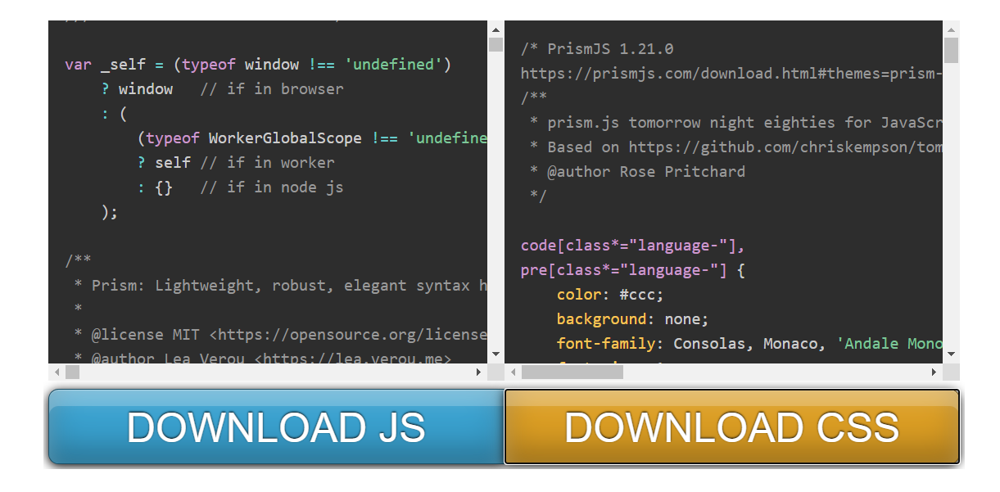

**下载**

-   3.文件放置位置

step1. 在themes\matery\source\js下新建prism文件夹，用来存放js与css代码。

step2. 找到此文件hexo-theme-matery\layout_partial\head.ejs打开，在标签之前黏贴以下代码：

```html
<link rel="stylesheet" href="/js/prism/prism.css"> 
```

> 如果不存在可以直接放在layout.ejs文件中

step3. 找到此文件hexo-theme-matery\layout_partial\footer.ejs打开，在最后部分黏贴以下代码：

```js
<script src="/js/prism/prism.js" async></script>
```

step4. 记得在hexo的根目录_config.yml下设置enable: false

`highlight: enable: false`

step5. 重新生成博客文件，重启本地服务。

`$ hexo clean hexo generate $ hexo server`

### [](https://xmq.plus/posts/2547c616.html#3-%E4%BB%A3%E7%A0%81%E5%8E%8B%E7%BC%A9%E6%8F%92%E4%BB%B6%E5%8E%8B%E7%BC%A9%E5%90%8E%E6%97%A0%E6%B3%95%E6%98%BE%E7%A4%BA%E5%8D%9A%E5%AE%A2%E6%96%87%E7%AB%A0 "3.代码压缩插件压缩后无法显示博客文章")3.代码压缩插件压缩后无法显示博客文章

**问题描述**：代码压缩脚本gulp生成的文章博客无法显示

**解决办法：**查看网页文章链接是否带有`.html`后缀，在配置文件中加上即可

**具体步骤：**

根目录下修改配置文件_config.yml：

```yml
pretty_urls:
    trailing_index: true # 是否在永久链接中保留尾部的 index.html，设置为 false 时去除
    trailing_html: true # 是否在永久链接中保留尾部的.html, 设置为false时去除(对尾部的index.html无效)
```

## [](https://xmq.plus/posts/2547c616.html#%E5%8F%82%E8%80%83%E6%96%87%E7%AB%A0 "参考文章")参考文章

-   [Hexo官方](https://hexo.io/zh-cn/)
-   [hexo-theme-matery](https://github.com/blinkfox/hexo-theme-matery/blob/develop/README_CN.md)
-   [Hexo+github 搭建博客 (超级详细版，精细入微)](https://yafine-blog.cn/posts/4ab2.html)
-   [Hexo+Github博客搭建完全教程](https://sunhwee.com/posts/6e8839eb.html)
-   [matery常见问题解决](https://zhangxiaocai.cn/posts/a53a9069.html)